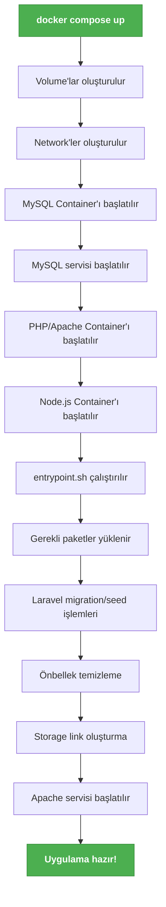

# Docker Pratik Rehber ve Sık Kullanılan Komutlar

Bu rehber, Docker ile yeni tanışanlar için temel kullanım, sık ihtiyaçlar ve pratik komutları içerir. Özellikle eğitim ortamınızda hızlıca uygulama geliştirmenize ve sorun çözmenize yardımcı olur.

---

## 1. Sık Kullanılan Docker Komutları

| Komut                             | Açıklama                                   |
| --------------------------------- | ------------------------------------------ |
| docker compose up -d              | Tüm servisleri arka planda başlatır        |
| docker compose down               | Tüm containerları durdurur ve siler        |
| docker compose restart            | Servisleri yeniden başlatır                |
| docker compose logs               | Logları gösterir                           |
| docker compose exec <servis> bash | Servis container'ına terminal ile bağlanır |
| docker ps                         | Çalışan containerları listeler             |
| docker volume ls                  | Volume'ları listeler                       |
| docker volume rm <volume_adı>     | Volume'u siler (veri kaybı!)               |

---

## 2. Docker Container İçine Terminal ile Girmek

Bir servisin (ör: PHP/Laravel) container'ına terminalden bağlanmak için:

```bash
docker compose exec app bash
```

- `app` burada docker-compose.yml'daki servis adıdır (PHP için `app`, Node için `node`, MySQL için `db`).
- Bağlandıktan sonra normal bir Ubuntu terminali gibi komut çalıştırabilirsiniz.

---

## 3. PHP'ye Yeni Eklenti (Extension) Kurmak (Ör: Fileinfo, PDO, FSP, vb.)

Varsayılan PHP Docker imajında bazı eklentiler yüklü gelmez. Yeni bir eklenti kurmak için önce terminalden app container'ına girin:

```bash
docker compose exec app bash
```

Sonra aşağıdaki gibi kurulum yapabilirsiniz (ör: fileinfo eklentisi için):

```bash
docker-php-ext-install fileinfo
```

Başka bir örnek: PDO MySQL için

```bash
docker-php-ext-install pdo_mysql
```

Kurulumdan sonra Apache'yi yeniden başlatın:

```bash
apache2-ctl restart
```

> Not: Bazı eklentiler için ek paketler gerekebilir. Hata alırsanız mesajı inceleyin ve eksik paketi `apt-get install` ile kurun.

---

## 4. Node/Frontend Container'ında Komut Çalıştırmak

```bash
docker compose exec node bash
```

Ardından klasik npm/yarn komutlarını uygulayabilirsiniz:

```bash
npm install
npm run dev
```

---

## 5. MySQL Container'ında SQL Çalıştırmak

MySQL veritabanı container'ında SQL sorguları çalıştırmak için şu adımları izleyin:

1. MySQL container'ına terminal ile bağlanın:

```bash
docker compose exec db bash
```

2. MySQL istemcisini başlatın:

```bash
mysql -u egitim -p
```

- Şifre olarak: `egitim123` yazın (docker-compose.yml dosyanızdaki şifre).

3. Artık klasik MySQL terminalindesiniz. Örnek sorgular:

```sql
SHOW DATABASES;
USE egitim;
SHOW TABLES;
SELECT * FROM urunler;
```

Çıkmak için:

```sql
exit
```

---

## 6. Docker Container'ına Uygulama Yükleme

Docker container'larına Ubuntu üzerinden uygulama yüklemek için aşağıdaki adımları izleyebilirsiniz:

### 1. Önce container'a girin

```bash
docker compose exec app bash
```

### 2. Paket listesini güncelleyin

```bash
apt-get update
```

### 3. İstediğiniz uygulamayı yükleyin

Örnekler:

```bash
# FFmpeg yüklemek için
apt-get install -y ffmpeg

# ZIP/ZIP unzip araçları için
apt-get install -y zip unzip

# Diğer faydalı araçlar
apt-get install -y wget curl git vim
```

### 4. Yüklemenin başarılı olduğunu kontrol edin

```bash
# Örnek: ffmpeg versiyonunu kontrol etme
ffmpeg -version
```

### 5. Eğer "apt-get" çalışmazsa

Bazı Docker imajlarında `apt-get` yerine `apt` kullanmanız gerekebilir:

```bash
apt update
apt install -y ffmpeg
```

### Önemli Not:

- Yaptığınız değişiklikler container silinene kadar kalıcıdır.
- Container'ı yeniden oluşturduğunuzda bu değişiklikler kaybolur.
- Kalıcı olması için Dockerfile'da bu paketleri eklemeniz gerekir.

---

## 7. Log Dosyaları ve İzleme

### Laravel Logları

- **Docker içindeki konum:** `/var/www/html/storage/logs/laravel.log`
- **Yerel makinede:** `./src/storage/logs/laravel.log`

### Apache Logları

- **Hata logları:** `/var/log/apache2/error.log`
- **Erişim logları:** `/var/log/apache2/access.log`

### MySQL Logları

- **Hata logları:** `/var/log/mysql/error.log`
- **Sorgu logları:** `/var/log/mysql/mysql-slow.log`

### Logları Gerçek Zamanlı İzleme

```bash
# Laravel loglarını izleme
docker compose exec app tail -f /var/www/html/storage/logs/laravel.log
# Apache hata loglarını izleme
docker compose exec app tail -f /var/log/apache2/error.log
# MySQL hata loglarını izleme
docker compose exec db tail -f /var/log/mysql/error.log
```

---

## 8. Sunucu Başlangıç Scriptleri

### 1. entrypoint.sh Kullanımı

1. `docker/entrypoint.sh` adında bir dosya oluşturun:

```bash
#!/bin/bash
# Gerekli paketleri kur
apt-get update
apt-get install -y ffmpeg
# Laravel migration ve seed işlemleri
php /var/www/html/artisan migrate --force
php /var/www/html/artisan db:seed --force
# Önbellek temizleme
php /var/www/html/artisan cache:clear
php /var/www/html/artisan view:clear
php /var/www/html/artisan config:clear
# Storage link oluştur
php /var/www/html/artisan storage:link
# Apache'yi başlat
apache2-foreground
```

2. Dockerfile'ınızı güncelleyin:

```dockerfile
# Mevcut Dockerfile içine ekleyin
COPY docker/entrypoint.sh /usr/local/bin/
RUN chmod +x /usr/local/bin/entrypoint.sh
# ENTRYPOINT tanımı
ENTRYPOINT ["entrypoint.sh"]
```

### 2. docker-compose.yml'a Komut Ekleme

```yaml
services:
  app:
    # ... diğer ayarlar
    command: >
      bash -c "
      php artisan migrate --force &&
      php artisan db:seed --force &&
      php artisan storage:link &&
      apache2-foreground
      "
```

### 3. Özel Script Çalıştırma

```bash
# Örnek: Tüm container'lar ayağa kalktıktan sonra çalışacak script
docker compose exec -T app bash -c "cd /var/www/html && php artisan migrate"
```

---

## 9. Docker Başlangıç Süreci

Aşağıdaki diyagram, `docker compose up` komutunun çalışması sırasında gerçekleşen işlemleri göstermektedir:



### Açıklamalar:

1. **Başlangıç:** `docker compose up` komutu çalıştırılır
2. **Hazırlık Aşaması:** Volume'lar ve network'ler oluşturulur
3. **Container Başlatma:** Sırasıyla tüm container'lar başlatılır
4. **Kurulum:** Her container kendi başlangıç scriptlerini çalıştırır
5. **Hazır:** Tüm servisler çalışır durumda

---

## 10. Pratik Notlar

- Kod değişiklikleri host makinede anında container'a yansır.
- Container silinirse kodlar ve db volume'u silinmez.
- Herhangi bir sorun olursa container loglarını inceleyin.
- Gerektiğinde container'ı veya tüm servisleri yeniden başlatabilirsiniz.

---

## 11. Docker Servis Yönetimi ve İleri Konular

### 1. Servisleri Yönetme

#### Tek Bir Servisi Yeniden Başlatma

```bash
docker compose restart <servis_adi>  # Örnekler:
docker compose restart egitim_app      # PHP/Apache
docker compose restart egitim_db       # MySQL
docker compose restart egitim_node     # Node.js
```

#### Tüm Servisleri Durdurma

```bash
docker compose down
```

#### Tüm Servisleri Durdurup Volume'ları da Silme

```bash
docker compose down -v
```

### 2. Disk Kullanımını Kontrol Etme

#### Tüm Docker Kaynaklarının Boyutunu Görme

```bash
docker system df
```

#### İmajları ve Boyutlarını Listeleme

```bash
docker images
```

#### Container'ların Disk Kullanımı

```bash
docker ps -s
```

### 3. Eğitim Sonrası Temizlik

#### Tüm Container'ları Durdur ve Sil

```bash
docker compose down --rmi all --volumes --remove-orphans
```

#### Kullanılmayan Tüm Docker Kaynaklarını Temizle

```bash
docker system prune -a --volumes
```

#### Belirli Bir Volume'u Silme

```bash
docker volume rm <volume_adi>
```

### 4. Farklı PHP Sürümleri ile Çalışma

#### docker-compose.yml'da PHP Sürümünü Değiştirme

```yaml
services:
  app:
    image: php:8.2-apache # İstediğiniz sürümü yazın (ör: 8.1, 8.0, 7.4)
    # ... diğer ayarlar
```

#### PHP Sürümünü Değiştirdikten Sonra

```bash
docker compose build --no-cache app
docker compose up -d
```

### 5. Apache mod_rewrite'ı Etkinleştirme

#### 1. .htaccess Dosyası Oluşturun

```apache
<IfModule mod_rewrite.c>
    <IfModule mod_negotiation.c>
        Options -MultiViews -Indexes
    </IfModule>
    RewriteEngine On
    # Handle Authorization Header
    RewriteCond %{HTTP:Authorization} .
    RewriteRule ^ - [E=HTTP_AUTHORIZATION:%{HTTP:Authorization}]
    # Redirect Trailing Slashes If Not A Folder...
    RewriteCond %{REQUEST_FILENAME} !-d
    RewriteCond %{REQUEST_URI} (.+)/$
    RewriteRule ^ %1 [L,R=301]
    # Send Requests To Front Controller...
    RewriteCond %{REQUEST_FILENAME} !-d
    RewriteCond %{REQUEST_FILENAME} !-f
    RewriteRule ^ index.php [L]
</IfModule>
```

#### 2. Apache'de mod_rewrite'ı Etkinleştirin

Eğer Dockerfile kullanıyorsanız:

```dockerfile
# Apache modüllerini etkinleştir
RUN a2enmod rewrite
# Apache ayarlarını güncelle
RUN sed -i '/<Directory \/var\/www\/>/,/<\/Directory>/ s/AllowOverride None/AllowOverride All/' /etc/apache2/apache2.conf
```

#### 3. Apache'yi Yeniden Başlatın

```bash
docker compose exec app apache2ctl restart
```

---

## 12. Yapılandırma Dosyaları ve Konumları

### Apache Yapılandırması

- **Ana yapılandırma dosyası:** `/etc/apache2/apache2.conf`
- **Siteler-available:** `/etc/apache2/sites-available/000-default.conf`
- **Modüller:** `/etc/apache2/mods-available/`
- **Log dosyaları:**
  - `/var/log/apache2/error.log`
  - `/var/log/apache2/access.log`

### PHP Yapılandırması

- **php.ini dosyası:** `/usr/local/etc/php/php.ini`
- **PHP-FPM yapılandırması:** `/usr/local/etc/php-fpm.d/www.conf`
- **Eklenti yapılandırmaları:** `/usr/local/etc/php/conf.d/`
- **PHP versiyonunu kontrol etme:** `php -v`
- **Yüklü eklentileri listeleme:** `php -m`

### MySQL Yapılandırması

- **my.cnf dosyası:** `/etc/mysql/my.cnf`
- **MySQL konfigürasyon klasörü:** `/etc/mysql/conf.d/`
- **Veri dizini:** `/var/lib/mysql/`
- **MySQL log dosyaları:**
  - `/var/log/mysql/error.log`
  - `/var/log/mysql/mysql-slow.log`

### Örnek: PHP Ayarlarını Güncelleme

1. Container'a bağlanın:
   ```bash
   docker compose exec app bash
   ```
2. php.ini'yi düzenleyin:
   ```bash
   nano /usr/local/etc/php/php.ini
   ```
3. İstediğiniz ayarları yapın, örneğin:
   ```
   upload_max_filesize = 64M
   post_max_size = 64M
   memory_limit = 256M
   ```
4. Apache'yi yeniden başlatın:
   ```bash
   apache2ctl restart
   ```

### Örnek: MySQL Yapılandırmasını Değiştirme

1. `docker-compose.yml` dosyanıza bir volume ekleyin:
   ```yaml
   services:
     db:
       volumes:
         - ./config/mysql/my.cnf:/etc/mysql/conf.d/custom.cnf
   ```
2. Yerel `config/mysql/my.cnf` dosyasını oluşturun ve ayarlarınızı yapın.
3. MySQL container'ını yeniden başlatın:
   ```bash
   docker compose restart db
   ```

---

## 13. Yerel Makineden Yapılandırma Dosyalarını Yönetme

Docker container'larındaki yapılandırma dosyalarını yerel makinenizde düzenlemek için volume bağlama (volume mounting) kullanabilirsiniz. Bu sayede:

- Yerel IDE'nizle düzenleme yapabilirsiniz
- Değişiklikler anında container'a yansır
- Dosyalarınızı versiyon kontrolüne ekleyebilirsiniz

### 1. PHP Yapılandırması İçin

`docker-compose.yml` dosyanıza şu şekilde volume ekleyin:

```yaml
services:
  app:
    volumes:
      - ./config/php/php.ini:/usr/local/etc/php/php.ini
      - ./config/php/conf.d/:/usr/local/etc/php/conf.d/
```

Dizin yapısı:

```
project/
├── docker-compose.yml
├── config/
│   └── php/
│       ├── php.ini
│       └── conf.d/
│           └── custom.ini
└── src/
```

### 2. Apache Yapılandırması İçin

```yaml
services:
  app:
    volumes:
      - ./config/apache/sites-available/:/etc/apache2/sites-available/
      - ./config/apache/mods-available/:/etc/apache2/mods-available/
```

### 3. MySQL Yapılandırması İçin

```yaml
services:
  db:
    volumes:
      - ./config/mysql/my.cnf:/etc/mysql/conf.d/custom.cnf
```

### 4. Uygulama Kodları İçin

Zaten mevcut olan volume tanımı:

```yaml
services:
  app:
    volumes:
      - ./src:/var/www/html
```

### 5. Tüm Yapılandırmayı Hazırlama Adımları

1. Önce container'daki orijinal dosyaları çıkarın:

   ```bash
   # PHP ayarları için
   mkdir -p config/php/conf.d
   docker compose cp app:/usr/local/etc/php/php.ini config/php/
   # Apache ayarları için
   mkdir -p config/apache
   docker compose cp app:/etc/apache2/sites-available/ config/apache/
   docker compose cp app:/etc/apache2/mods-available/ config/apache/
   # MySQL ayarları için
   mkdir -p config/mysql
   docker compose cp db:/etc/mysql/conf.d/ config/mysql/
   ```

2. `docker-compose.yml` dosyanıza yukarıdaki volume tanımlarını ekleyin

3. Container'ları yeniden başlatın:
   ```bash
   docker compose down
   docker compose up -d
   ```

### Örnek Kullanım

1. PHP ayarlarını düzenlemek için:

   ```bash
   # Yerel makinede düzenleme yapın
   code config/php/php.ini
   # Değişiklikler otomatik olarak yansıyacaktır
   # Gerekirse Apache'yi yeniden başlatın
   docker compose exec app apache2ctl restart
   ```

### Önemli Notlar

- Bu yöntemle yapılan değişiklikler container silinse bile kaybolmaz
- Tüm yapılandırma dosyalarınız `config/` dizini altında düzenli bir şekilde saklanır
- Bu dizini Git gibi bir versiyon kontrol sistemine ekleyebilirsiniz

---

## 14. Volume ve Konfigürasyon Dosyaları Hakkında Önemli Bilgiler

### Volume'ların Çalışma Mantığı

Docker volume'ları konfigürasyon dosyalarıyla çalışırken dikkat edilmesi gereken önemli bir nokta vardır:

- **Yerel dizin boşsa:** Eğer bir volume ile container'daki bir dizini yerel boş bir dizine bağlarsanız, container'daki dosyalar otomatik olarak yerel dizine kopyalanmaz. Bunun yerine, container'daki dizin içeriği **gizlenir** ve boş bir dizin bağlanmış gibi davranılır.
- **Yerel dizin doluysa:** Yerel dizinde bulunan dosyalar container'daki dizini tamamen **ezer** ve container'ın orijinal dosyalarına erişilemez hale gelir.

### Konfigürasyon Dosyalarını Yönetme Adımları

1. **Öncelikle container'ı volumesuz başlatın:**

   ```bash
   # docker-compose.yml'de volume tanımlarını geçici olarak kaldırın
   # Ardından container'ı başlatın
   docker compose up -d
   ```

2. **Gerekli dosyaları container'dan yerel dizine kopyalayın:**

   ```bash
   # Dizin yapısını oluştur
   mkdir -p config/php config/apache/sites-available config/mysql
   # PHP ayarlarını kopyala
   docker cp <container_adi>:/usr/local/etc/php/php.ini ./config/php/
   # Apache site konfigürasyonlarını kopyala
   docker cp <container_adi>:/etc/apache2/sites-available/000-default.conf ./config/apache/sites-available/
   # MySQL yapılandırmasını kopyala (eğer gerekliyse)
   docker cp <container_adi>:/etc/mysql/conf.d/ ./config/mysql/
   ```

3. **Container'ı durdurup volume'ları etkinleştirin:**

   ```bash
   # Container'ı durdur
   docker compose down
   # docker-compose.yml'de volume tanımlarını ekleyin
   # Örnek:
   # volumes:
   #   - ./config/php/php.ini:/usr/local/etc/php/php.ini
   #   - ./config/apache/sites-available/:/etc/apache2/sites-available/
   #   - ./config/mysql/conf.d/:/etc/mysql/conf.d/
   # Container'ı tekrar başlat
   docker compose up -d
   ```

### Önemli Uyarılar

1. **Veri Kaybı Riski:** Container'ı volume'lar etkin şekilde başlattıktan sonra, container'daki orijinal dosyalara erişemezsiniz. Tüm değişiklikler yerel dosyalar üzerinden yapılmalıdır.
2. **İlk Kurulumda Dikkat:** Yeni bir projeye başlarken, önce container'ın kendi default dosyalarıyla çalışmasına izin verin. Daha sonra ihtiyaç duydukça dosyaları dışarı çıkarıp özelleştirin.
3. **Güncellemeler:** Container imajı güncellendiğinde, yeni default ayarları almak için bu işlemi tekrarlamanız gerekebilir.
4. **Veritabanı Dosyaları:** Veritabanı dosyalarını (örneğin MySQL'in `/var/lib/mysql` dizini) asla doğrudan volume ile eşlemeyin. Bunun yerine sadece konfigürasyon dosyalarını eşleyin.

### Proje Dizin Yapısı

```
proje-adi/
├── docker-compose.yml       # Docker Compose yapılandırması
├── .env                    # Ortam değişkenleri
├── config/                 # Tüm yapılandırmalar
│   ├── php/               # PHP ayarları
│   │   ├── php.ini        # PHP ana yapılandırması
│   │   └── conf.d/        # PHP eklenti ayarları
│   ├── apache/            # Apache ayarları
│   │   ├── sites-available/  # Site yapılandırmaları
│   │   └── mods-available/   # Modül yapılandırmaları
│   └── mysql/             # MySQL ayarları
│       └── my.cnf         # MySQL yapılandırması
└── src/                    # Uygulama kodları
    ├── public/            # Web kök dizini
    ├── app/               # Uygulama dosyaları
    └── storage/           # Depolama (log'lar, önbellek)
```

### Yerel Makine ↔ Container Eşleşmeleri

| Yerel Makine                       | Container İçi                   | Açıklama                     |
| ---------------------------------- | ------------------------------- | ---------------------------- |
| `./src`                            | `/var/www/html`                 | Uygulama kodları             |
| `./config/php/php.ini`             | `/usr/local/etc/php/php.ini`    | PHP ana yapılandırması       |
| `./config/php/conf.d/`             | `/usr/local/etc/php/conf.d/`    | PHP eklenti ayarları         |
| `./config/apache/sites-available/` | `/etc/apache2/sites-available/` | Apache site yapılandırmaları |
| `./config/mysql/my.cnf`            | `/etc/mysql/conf.d/custom.cnf`  | MySQL özel yapılandırması    |

### Örnek Kullanım

1. **PHP ayarını değiştirmek için:**

   ```bash
   # Yerel makinede düzenle
   nano config/php/php.ini
   # Değişiklikler otomatik yansır
   ```

2. **Yeni bir Apache sitesi eklemek için:**

   ```bash
   # Yerel makinede yeni konfigürasyon oluştur
   nano config/apache/sites-available/sitem.conf
   # Container'da etkinleştir
   docker compose exec app a2ensite sitem.conf
   docker compose exec app apache2ctl graceful
   ```

3. **MySQL yapılandırmasını güncellemek için:**
   ```bash
   # Yerel makinede düzenle
   nano config/mysql/my.cnf
   # MySQL'i yeniden başlat
   docker compose restart db
   ```

### Önemli Notlar

- Tüm yapılandırma dosyalarınız `config/` altında düzenli bir şekilde saklanır
- Bu yapıyı Git gibi bir versiyon kontrol sistemine ekleyebilirsiniz
- Hassas bilgileri (şifreler, API anahtarları) `.env` dosyasında tutun
- Veritabanı gibi önemli veriler için düzenli yedek alın
