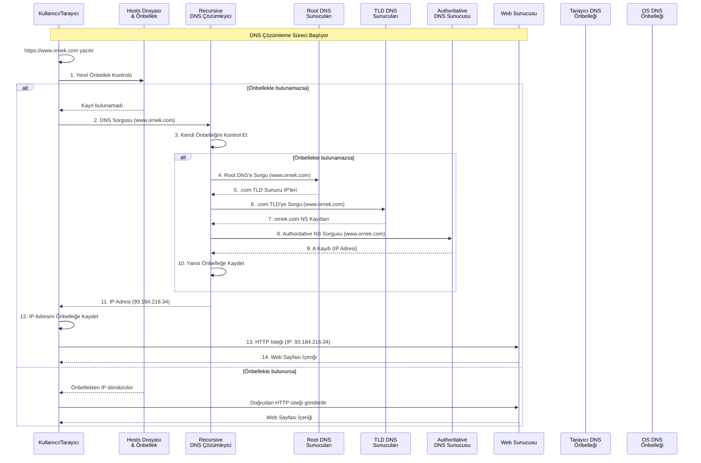

# DNS Çözümleme Süreci

DNS Çözümleme, kullanıcıların hatırlaması kolay alan adlarını, bilgisayarların anlayabildiği IP adreslerine çevirerek internetin temel işleyişini mümkün kılar.

## DNS Çözümleme Süreci Açıklaması (ÖZET)

Bir kullanıcının tarayıcısına bir web adresi yazdığında gerçekleşen DNS (Alan Adı Sistemi) çözümleme süreci adım adım şu şekildedir:

1. **Yerel Önbellek Kontrolü**

   - Tarayıcı önce kendi DNS önbelleğini kontrol eder.
   - Eğer adres daha önce ziyaret edilmişse, IP adresi doğrudan önbellekten alınır.

2. **Hosts Dosyası Kontrolü**

   - Eğer tarayıcı önbelleğinde bulunamazsa, işletim sisteminin hosts dosyası kontrol edilir.

3. **DNS Sunucusuna Sorgu**

   - Yerel önbelleklerde bulunamazsa, sistem yapılandırılmış DNS sunucusuna (genellikle ISP'nin DNS sunucusu) sorgu gönderilir.

4. **Özyinelemeli Sorgulama**

   - DNS çözümleyici kendi önbelleğinde bilgi yoksa, hiyerarşik olarak kök DNS sunucularına, ardından TLD (.com, .org gibi) sunucularına ve son olarak alan adının yetkili DNS sunucularına sorgu gönderir.

5. **Yanıtın İletilmesi**

   - Bulunan IP adresi, istemciye geri döndürülür ve çeşitli önbellek katmanlarında saklanır.
   - Tarayıcı, alınan IP adresini kullanarak doğrudan web sunucusuna bağlanır.

6. **Önbellekleme**
   - Tüm bu süreç boyunca, her adımda alınan yanıtlar önbelleğe alınarak performans artışı sağlanır.
   - TTL (Time To Live) değerleri, önbelleklerde ne kadar süre saklanacaklarını belirler.

## DNS Çözümleme Süreci Açıklaması (DETAY)

Bir kullanıcının tarayıcısına bir web adresi yazdığında gerçekleşen DNS (Alan Adı Sistemi) çözümleme süreci adım adım şu şekildedir:

1. **Yerel Önbellek Kontrolü**

   - Tarayıcı önce kendi DNS önbelleğini kontrol eder.
   - Eğer adres daha önce ziyaret edilmişse, IP adresi doğrudan önbellekten alınır.
   - İşletim sistemi önbelleği de kontrol edilir (`ipconfig /displaydns` veya `systemd-resolve --statistics` ile görüntülenebilir).

2. **Hosts Dosyası Kontrolü**

   - Eğer tarayıcı önbelleğinde bulunamazsa, işletim sisteminin hosts dosyası kontrol edilir.
   - Hosts dosyası, özel yönlendirmeler için manuel olarak düzenlenebilir.
   - Konumları:
     - Windows: `C:\Windows\System32\drivers\etc\hosts`
     - Linux/macOS: `/etc/hosts`

3. **DNS Sunucusuna Sorgu**

   - Yerel önbelleklerde bulunamazsa, sistem yapılandırılmış DNS sunucusuna (genellikle ISP'nin DNS sunucusu) sorgu gönderilir.
   - Alternatif DNS sunucuları:
     - Google DNS: 8.8.8.8, 8.8.4.4
     - Cloudflare: 1.1.1.1, 1.0.0.1
     - OpenDNS: 208.67.222.222, 208.67.220.220

4. **Özyinelemeli Sorgulama**

   - DNS çözümleyici kendi önbelleğinde bilgi yoksa, hiyerarşik olarak:
     1. Kök DNS sunucularına (a-m.root-servers.net gibi)
     2. İlgili TLD (.com, .org gibi) sunucularına
     3. Alan adının yetkili (authoritative) DNS sunucularına sorgu gönderir.
   - Her adımda ilgili NS (Name Server) kayıtları sorgulanır.

5. **DNS Kayıt Tipleri**

   - **A/AAAA**: IPv4/IPv6 adres kaydı
   - **MX**: Mail sunucusu kaydı
   - **CNAME**: Takma ad (alias) yönlendirmesi
   - **TXT**: Metin kayıtları (SPF, DKIM, DMARC gibi)
   - **NS**: Alan adı sunucuları
   - **SOA**: Bölge başlangıç kaydı

6. **Güvenli DNS Çözümleme**

   - **DNSSEC**: DNS yanıtlarının doğruluğunu sağlar
   - **DoH (DNS over HTTPS)**: HTTPS üzerinden şifreli DNS
   - **DoT (DNS over TLS)**: TLS şifrelemesi ile DNS

7. **Yanıtın İletilmesi**

   - Bulunan IP adresi, istemciye geri döndürülür ve çeşitli önbellek katmanlarında saklanır.
   - TTL (Time To Live) değerleri, önbelleklerde ne kadar süre saklanacaklarını belirler.
   - Önbellek temizleme komutları:
     - Windows: `ipconfig /flushdns`
     - Linux: `sudo systemd-resolve --flush-caches`
     - macOS: `sudo killall -HUP mDNSResponder`

8. **Önbellekleme ve Performans**

   - Önbellek katmanları (Tarayıcı → İşletim Sistemi → Yönlendirici → ISP)
   - Anycast DNS: Coğrafi olarak dağıtılmış sunucular ile hızlı yanıt
   - Önbellek zehirlenmesi (cache poisoning) güvenlik önlemleri

9. **Hata Durumları**

   - **NXDOMAIN**: Alan adı bulunamadı
   - **SERVFAIL**: Sunucu yanıt veremedi
   - **REFUSED**: Sunucu sorguyu reddetti
   - **TIMEOUT**: Zaman aşımı

10. **Gelişmiş Kullanım**
    - Özel DNS sunucuları (Pi-hole, Unbound gibi)
    - Yerel ağda özel DNS çözümleme
    - DNS filtreleme ve engelleme

Bu süreç, kullanıcıların hatırlaması kolay alan adlarını, bilgisayarların anlayabildiği IP adreslerine çevirerek internetin temel işleyişini mümkün kılar. Ayrıca güvenlik, performans ve esneklik için çeşitli mekanizmalar içerir.
