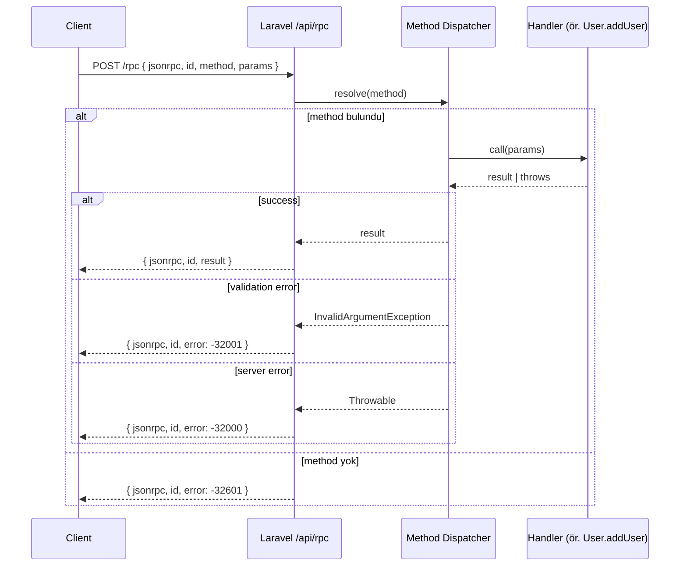

# RPC Notu (Remote Procedure Call)

Kısa özet: RPC, uzak bir sunucudaki fonksiyonu/metodu sanki yerelmiş gibi çağırma modelidir. İstemci `method` + `params` gönderir, sunucu çalıştırır ve sonucu döner.

## 1) Temel Kavramlar

- **Arayüz/Sözleşme**: Çağrılabilir metot imzaları (ad, parametre, dönüş tipi)
- **Serileştirme**: JSON, Protobuf, XML
- **Taşıma**: HTTP/1.1, HTTP/2, TCP
- **Hata/Sonuç**: Standart bir başarı/hata zarfı (envelope) kullanmak önemli

## 2) Yaygın Türler

- **JSON-RPC / XML-RPC**: HTTP üzerinden hafif "metot çağrısı" modeli
- **gRPC**: HTTP/2 + Protobuf (yüksek performans, tip güvenliği, streaming)
- **SOAP**: XML + WSDL (kurumsal, ağır fakat standartlı)

## 3) REST'e Göre Farklar

- REST: Kaynak odaklı (resource + HTTP fiilleri)
- RPC: Metot/aksiyon odaklı (ör. `UserService.ResetPassword`)

## 4) Laravel ile RPC

- **JSON-RPC**: Kolay entegrasyon; tek endpoint (`/rpc`) → controller içinde method haritalama
- **gRPC (istemci)**: Laravel servisiniz diğer dillerdeki gRPC servislerine bağlanabilir (bkz: `Fikirler/grpc-notu.md`)
- **SOAP**: Legacy sistemler için `ext-soap` veya paketlerle

## 5) JSON-RPC Minimal Örnek (Laravel)

İstek (HTTP POST `/api/rpc`):

```json
{
  "jsonrpc": "2.0",
  "id": "123",
  "method": "User.resetPassword",
  "params": { "email": "foo@example.com" }
}
```

Başarılı yanıt:

```json
{
  "jsonrpc": "2.0",
  "id": "123",
  "result": { "status": "ok" }
}
```

Hata yanıtı (JSON-RPC 2.0):

```json
{
  "jsonrpc": "2.0",
  "id": "123",
  "error": { "code": -32601, "message": "Method not found" }
}
```

Controller iskeleti (özet):

```php
// routes/api.php
Route::post('/rpc', [\App\Http\Controllers\RpcController::class, 'handle']);
```

```php
<?php
// app/Http/Controllers/RpcController.php

namespace App\Http\Controllers;

use Illuminate\Http\Request;
use Symfony\Component\HttpFoundation\Response;

class RpcController extends Controller
{
    private array $methods = [
        'User.resetPassword' => [self::class, 'resetPassword'],
    ];

    public function handle(Request $request): Response
    {
        $payload = $request->json()->all();
        $id = $payload['id'] ?? null;
        $method = $payload['method'] ?? null;
        $params = $payload['params'] ?? [];

        if (!isset($this->methods[$method])) {
            return response()->json([
                'jsonrpc' => '2.0', 'id' => $id,
                'error' => ['code' => -32601, 'message' => 'Method not found'],
            ]);
        }

        try {
            $result = call_user_func($this->methods[$method], $params);
            return response()->json(['jsonrpc' => '2.0', 'id' => $id, 'result' => $result]);
        } catch (\Throwable $e) {
            return response()->json([
                'jsonrpc' => '2.0', 'id' => $id,
                'error' => ['code' => -32000, 'message' => 'Server error']
            ], 500);
        }
    }

    private static function resetPassword(array $params): array
    {
        // İş mantığı... örn. Password reset token oluşturma
        return ['status' => 'ok'];
    }
}
```

## 6) Versiyonlama ve Genişletme

- Metot adlarına versiyon öneki: `v1.User.resetPassword`
- Yeni parametreler eklendiğinde geriye dönük uyum: opsiyonel alanlar, varsayılanlar
- Hata kodları için sabit bir tablo tutun (ör. `-32001 INVALID_ARGUMENT`)

## 7) Güvenlik

- Kimlik doğrulama: Authorization: Bearer JWT (header) veya `params.authToken`
- İmzalama/Replay koruması: nonce + timestamp, HMAC
- Rate limiting ve IP allowlist
- Girdi doğrulama: Laravel `FormRequest`/`Validator`

## 8) Ne Zaman JSON-RPC Seçilmeli?

- Basit, hafif, "metot çağrısı" yaklaşımı istendiğinde
- Çok sayıda küçük aksiyonun hızlı tanımlanması gerektiğinde
- gRPC altyapısı mümkün değilken JSON/HTTP ile RPC modeli isteniyorsa

## 9) Örnekler

- [JSON-RPC addUser ve listUsers ayrıntılı örnekleri](./rpc-notu-ornekler.md)

## 10) Neden 1 adet endpoint var?

- **JSON-RPC modeli gereği**: RPC, "metot adı + parametreler" taşıyan tek bir giriş noktası üzerinden çalışmayı teşvik eder. Bu nedenle `routes/api.php` içinde genellikle tek bir endpoint (`/rpc`) tanımlanır ve sunucu tarafında `method` alanına göre yönlendirme yapılır.
- **Yönlendirme basitliği**: HTTP route çoğaltmak yerine, uygulama içi bir metot haritalama (dispatch) tablosu kullanılır: `method => handler`. Örn. `User.addUser`, `User.listUsers`, `User.resetPassword` → `RpcController::$methods`.
- **Sözleşme odaklı tasarım**: Kaynak/URL yerine arayüz/sözleşme (metot imzaları) merkezde olur. Versiyonlama da metot adına önek ekleyerek yapılabilir: `v1.User.addUser`.
- **İstemci tarafı kolaylığı**: Tek endpoint’e farklı metot çağrıları göndererek istemci SDK'larında tek bir `call(method, params)` API’si yeterli olur.

### Artılar

- **Basitlik**: Tek endpoint, merkezi doğrulama/kimlik doğrulama ve rate limit politikaları.
- **Esneklik**: Yeni fonksiyonlar eklemek için yeni HTTP route açmaya gerek kalmaz; dispatch tablosuna yeni metot eklemek yeterlidir.
- **Şema bağımsızlığı**: REST URL tasarım kararlarına takılmadan aksiyon/işlev odaklı genişleme.

### Eksiler

- **HTTP önbellekleme/SEO**: URL bazlı cache/araç entegrasyonları (CDN, tarayıcı cache) sınırlı kullanılır; genellikle uygulama içi cache gerekir.
- **Gözlemlenebilirlik**: Tek endpoint altında farklı metotların ayrıştırılması için ilave loglama/metric/trace etiketleri gerekir (örn. `rpc.method` etiketi).
- **Gateway/Proxy kuralları**: Rate limit ve WAF kuralları method adına göre (body içinden) yapılmalıdır; bu da bazı edge/gateway ürünlerinde ek yapılandırma ister.

### Alternatifler

- **Birden çok endpoint**: JSON-RPC’yi taklit edip metotları ayrı URL’lere dağıtmak mümkün olsa da, standart JSON-RPC istemci/araçları tek endpoint varsayımına dayanır.
- **REST**: Kaynak odaklı, HTTP semantiği ve önbellekleme avantajlarıyla çoklu endpoint tasarımı için uygundur.
- **gRPC**: Tek bir HTTP/2 bağlantısı üstünde çok sayıda servis/metot; ama burada da "tek endpoint" kavramı yerine kanal üzerinde servis/metot ayrımı bulunur.

## 11) Diyagram: JSON-RPC Akış

Aşağıdaki diyagram tek endpoint (`/api/rpc`) üzerinden method-dispatch akışını özetler.



### Notlar

- **JWT/Rate Limit**: Kimlik doğrulama ve oran sınırlama tek endpoint katmanında uygulanır; içeride metot bazlı ilave kontroller yapılabilir.
- **Gözlemlenebilirlik**: Log/trace/metric’lerde `rpc.method` (ör. `User.addUser`) etiketi kullanın.
- **Versiyonlama**: `v1.User.addUser` gibi öneklerle aynı endpoint altında çoklu sürüm çağrılarını destekleyin.
