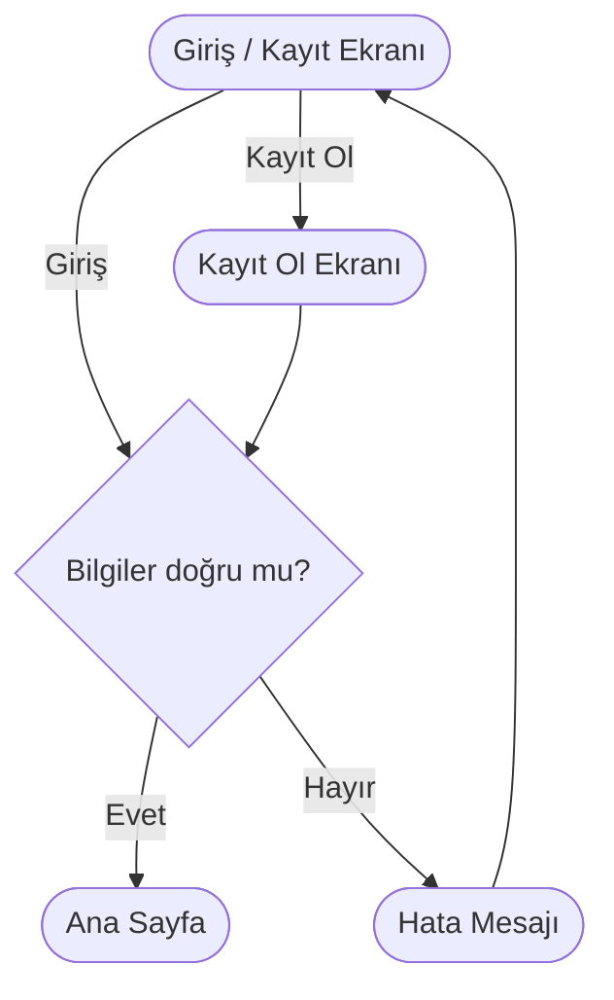
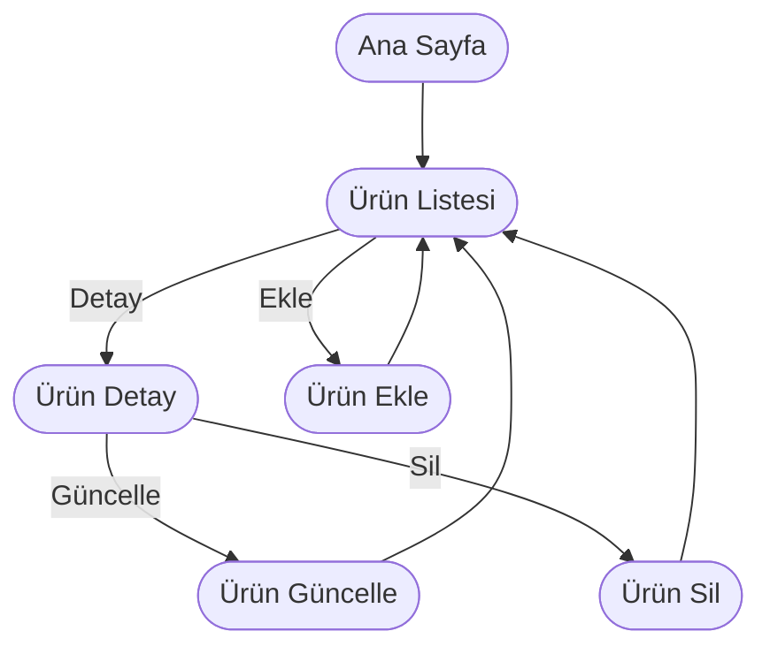
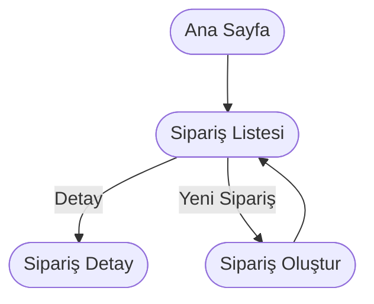
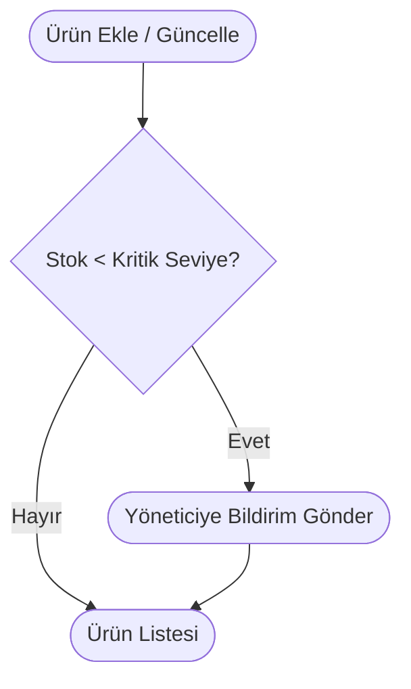
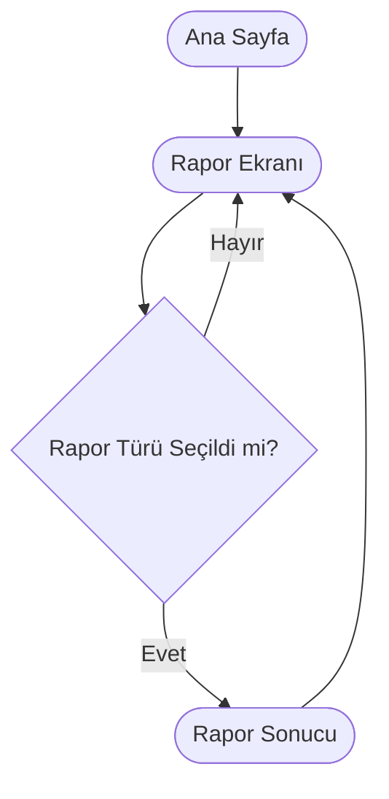

# Örnek Akış Diyagramları (Mermaid)

Bu dosyada, [ornek-prd.md](ornek-prd.md) dokümanındaki temel ekranlar ve önemli kullanıcı akışları için mermaid ile hazırlanmış akış diyagramları yer almaktadır.

---

## 1. Kullanıcı Giriş/Kayıt Akışı

---

## 2. Ürün Yönetimi Akışı

---

## 3. Sipariş Yönetimi Akışı

---

## 4. Stok Azalma ve Bildirim Akışı

---

## 5. Raporlama Akışı

---

Her diyagram, PRD'deki ilgili ekran veya iş akışı için temel kullanıcı yolculuğunu ve karar noktalarını özetler. Gerekirse daha fazla akış ekleyebilirim.
