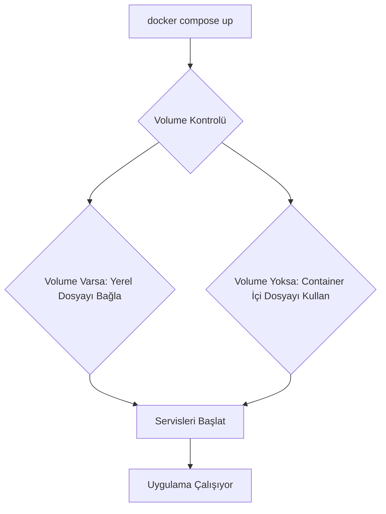

# Docker Pratik Rehber ve Sık Kullanılan Komutlar

Bu rehber, Docker ile yeni tanışanlar için temel kullanım, sık ihtiyaçlar ve pratik komutları içerir. Özellikle eğitim ortamınızda hızlıca uygulama geliştirmenize ve sorun çözmenize yardımcı olur.

---

## 1. Temel Container Etkileşimleri

### 1.1. Container İçine Terminal ile Girmek (exec)

Bir servisin (ör: PHP/Laravel) container'ına terminalden bağlanmak için:

```bash
docker compose exec app bash
```

- `app` burada `docker-compose.yml`'daki servis adıdır (PHP için `app`, Node için `node`, MySQL için `db`).
- Bağlandıktan sonra normal bir Ubuntu terminali gibi komut çalıştırabilirsiniz.

### 1.2. MySQL Container'ında SQL Çalıştırmak

1. MySQL container'ına terminal ile bağlanın:

    ```bash
    docker compose exec db bash
    ```

2. MySQL istemcisini başlatın:

    ```bash
    mysql -u egitim -p
    ```

    - Şifre olarak: `egitim123` yazın (`docker-compose.yml` dosyanızdaki şifre).

3. Artık klasik MySQL terminalindesiniz. Örnek sorgular:

    ```sql
    SHOW DATABASES;
    USE egitim;
    SHOW TABLES;
    SELECT * FROM urunler;
    ```

---

## 2. Sık Kullanılan Docker Komutları

| Komut                             | Açıklama                                |
| --------------------------------- | --------------------------------------- |
| `docker compose up -d`              | Tüm servisleri arka planda başlatır     |
| `docker compose down`               | Tüm containerları durdurur ve siler     |
| `docker compose restart <servis_adi>` | Belirli bir servisi yeniden başlatır    |
| `docker compose logs -f <servis_adi>` | Belirli bir servisin loglarını izler    |
| `docker ps`                         | Çalışan containerları listeler          |
| `docker images`                     | İmajları listeler                       |
| `docker volume ls`                  | Volume'ları listeler                    |
| `docker system df`                  | Docker disk kullanımını gösterir        |
| `docker system prune -a --volumes`  | Kullanılmayan tüm kaynakları temizler   |

---

## 3. Paket ve Eklenti Yönetimi

### 3.1. PHP'ye Yeni Eklenti (Extension) Kurmak

Varsayılan PHP imajında bazı eklentiler eksik olabilir. Kurmak için:

1. `app` container'ına girin:

    ```bash
    docker compose exec app bash
    ```

2. Eklentiyi kurun (örnek: `pdo_mysql`):

    ```bash
    docker-php-ext-install pdo_mysql
    ```

3. Apache'yi yeniden başlatın:

    ```bash
    apache2-ctl restart
    ```

### 3.2. Container'a Yeni Uygulama Yüklemek (apt-get)

1. İlgili container'a girin (ör: `app`).

2. Paket listesini güncelleyin:

    ```bash
    apt-get update
    ```

3. İstediğiniz uygulamayı yükleyin:

    ```bash
    # Örnek: FFmpeg ve zip araçları
    apt-get install -y ffmpeg zip unzip
    ```

> **Not:** Bu şekilde yapılan değişiklikler geçicidir. Container yeniden oluşturulduğunda kaybolur. Kalıcı değişiklikler için `Dockerfile`'ı düzenlemeniz gerekir.

---

## 4. Yapılandırma ve Veri Yönetimi (Volumes)

### 4.1. Varsayılan Yapılandırma Dosyası Konumları

- **Apache:** `/etc/apache2/sites-available/000-default.conf`
- **PHP:** `/usr/local/etc/php/php.ini`
- **MySQL:** `/etc/mysql/my.cnf`

### 4.2. Yapılandırma Dosyalarını Volume ile Yönetme

`docker-compose.yml` içinde `volumes` direktifini kullanarak yerel dosyalarınızı container'daki yollarla eşleyebilirsiniz. Bu sayede yapılandırmayı projenizle birlikte yönetebilirsiniz.

**Örnek `docker-compose.yml` Eşlemesi:**

```yaml
services:
  app:
    volumes:
      - ./src:/var/www/html  # Proje kodları
      - ./config/php.ini:/usr/local/etc/php/php.ini # PHP ayarları
      - ./config/000-default.conf:/etc/apache2/sites-available/000-default.conf # Apache ayarları
```

### 4.3. Önemli Uyarı: Boş Yerel Dosya Sorunu

**Sorun:** Eğer yukarıdaki gibi eşlenen `./config/php.ini` dosyası yerel makinenizde boşsa veya hiç yoksa, servisler (PHP, Apache) düzgün başlamaz.

**Çözüm (Önerilen):**

1. `docker-compose.yml`'daki ilgili `volumes` satırını geçici olarak yorum yapın.
2. `docker compose up -d` ile servisleri başlatın.
3. `docker compose cp app:/usr/local/etc/php/php.ini ./config/php.ini` komutuyla varsayılan dosyayı yerel makinenize kopyalayın.
4. Yorumu kaldırın ve `docker compose up -d --force-recreate` ile yeniden başlatın.

---

## 5. Log Yönetimi

### 5.1. Log Dosyası Konumları

- **Laravel:** `/var/www/html/storage/logs/laravel.log`
- **Apache Hata:** `/var/log/apache2/error.log`
- **MySQL Hata:** `/var/log/mysql/error.log`

### 5.2. Logları Gerçek Zamanlı İzleme

```bash
# Apache hata loglarını izleme
docker compose logs -f app

# Alternatif olarak tail komutu ile
docker compose exec app tail -f /var/log/apache2/error.log
```

---

## 6. Başlangıç Scriptleri ve Otomasyon

`docker compose up` ile birlikte otomatik olarak çalışmasını istediğiniz komutları (veritabanı migrate, cache temizleme vb.) `entrypoint.sh` script'i veya `docker-compose.yml` içindeki `command` direktifi ile yönetebilirsiniz.

### 6.1. `entrypoint.sh` Kullanımı

1. Projenizde `entrypoint.sh` adında bir dosya oluşturun ve içine başlangıç komutlarınızı yazın.

    ```bash
    #!/bin/bash
    # Laravel migration ve seed işlemleri
    php /var/www/html/artisan migrate --force
    # Apache'yi başlat
    apache2-foreground
    ```

2. `Dockerfile`'ınızı bu script'i çalıştıracak şekilde güncelleyin:

    ```dockerfile
    COPY entrypoint.sh /usr/local/bin/
    RUN chmod +x /usr/local/bin/entrypoint.sh
    ENTRYPOINT ["entrypoint.sh"]
    ```

### 6.2. `docker-compose.yml` `command` Kullanımı

Küçük otomasyonlar için `Dockerfile` değiştirmeden `command` direktifi kullanılabilir:

```yaml
services:
  app:
    command: >
      bash -c "php artisan migrate --force && apache2-foreground"
```

---

## 7. Gelişmiş Konular

### 7.1. Farklı PHP Sürümleri ile Çalışma

`docker-compose.yml` dosyasındaki `image` tanımını değiştirerek PHP sürümünü kolayca değiştirebilirsiniz:

```yaml
services:
  app:
    image: php:8.2-apache # İstediğiniz sürümü yazın (ör: 8.1, 8.0)
```

Değişiklik sonrası container'ı yeniden oluşturun:

```bash
docker compose up -d --force-recreate --build
```

### 7.2. Apache `mod_rewrite` Etkinleştirme

Laravel gibi modern framework'ler için `mod_rewrite` gereklidir. Genellikle `php:*-apache` imajlarında varsayılan olarak aktiftir. Değilse, şu komutlarla aktif edebilirsiniz:

```bash
docker compose exec app a2enmod rewrite
docker compose exec app apache2ctl restart
```

---

## 8. Sık Karşılaşılan Kullanım Örnekleri

### 8.1. PHP Ayarını Değiştirmek

```bash
# Yerel makinede düzenle
nano config/php/php.ini
# Değişiklikler anında yansır, gerekirse servisi yeniden başlatın
docker compose restart app
```

### 8.2. Yeni Bir Apache Sitesi Eklemek

```bash
# Yerel makinede yeni konfigürasyon oluştur
cp config/apache/000-default.conf config/apache/sitem.conf
# Yeni dosyayı düzenle...
# Container'da etkinleştir ve yeniden başlat
docker compose exec app a2ensite sitem.conf
docker compose exec app apache2ctl graceful
```

### 8.3. MySQL Yapılandırmasını Güncellemek

```bash
# Yerel makinede düzenle
nano config/mysql/my.cnf
# Değişikliklerin etkili olması için MySQL'i yeniden başlat
docker compose restart db
```

---

## 9. Servis ve İmaj Temizliği

Docker ortamınızı temiz ve düzenli tutmak için aşağıdaki komutları kullanabilirsiniz.

### 9.1. Servisleri Yönetme ve Yeniden Başlatma

```bash
# Belirli servisleri yeniden başlatma
docker compose restart <servis_adi_1> <servis_adi_2>

# Tüm servisleri yeniden başlatma
docker compose restart
```

### 9.2. Kaynakları Temizleme (İmaj, Container, Volume)

```bash
# Kullanılmayan container'ları temizleme
docker container prune

# Kullanılmayan imajları temizleme
docker image prune -a

# Kullanılmayan volume'ları temizleme
docker volume prune

# Kullanılmayan ağları temizleme
docker network prune

# Tüm sistemi temizleme (dikkatli kullanın!)
docker system prune -a --volumes
```

---

## 10. Sık Kullanılan Servis İsimleri

- **PHP/Laravel:** `app`
- **Node.js:** `node`
- **MySQL/MariaDB:** `db`
- **PostgreSQL:** `postgres`
- **Redis:** `redis`

---

## 11. Docker Başlangıç Süreci (Mermaid Diyagramı)


