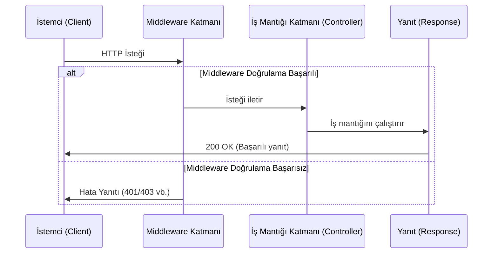
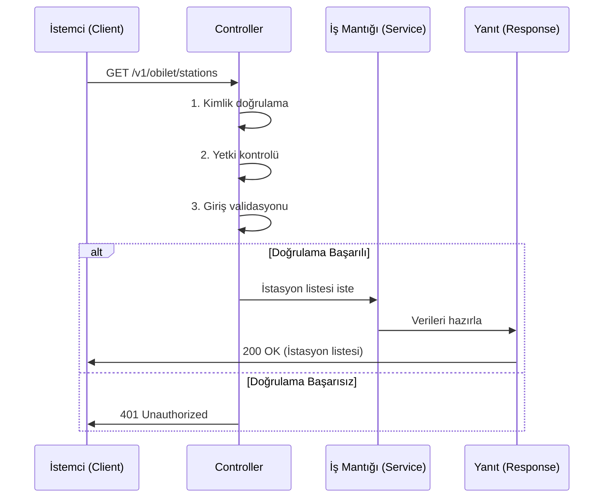
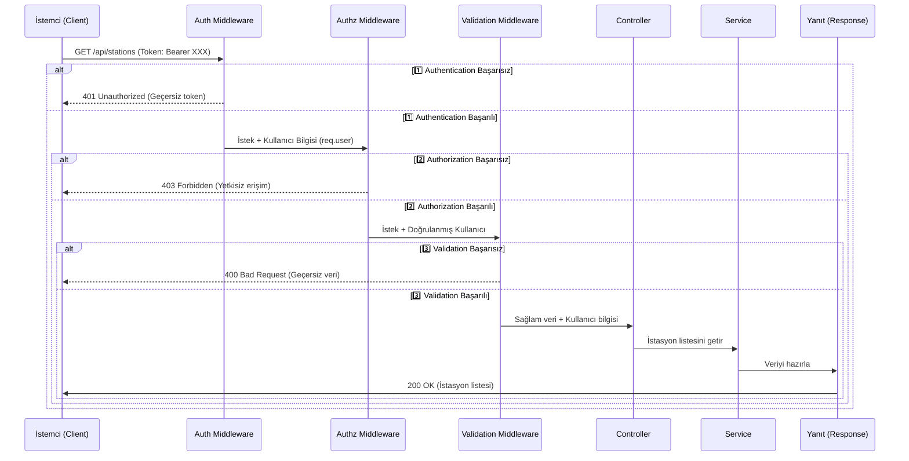

# Middleware Nedir?

Middleware, erişimi kontrol eden bir "bekçi" görevi görür.

Laravel’in en güçlü özelliklerinden biri olan middleware kavramını detaylıca inceleyelim.

---

## ✅ **MIDDLEWARE NEDİR?**

Middleware, bir HTTP isteği uygulamaya ulaşmadan **önce** ya da uygulamadan çıktıktan **sonra** araya giren yazılım katmanıdır.

Genellikle şu amaçlarla kullanılır:

- Kimlik doğrulama (authentication)
- Yetkilendirme (authorization)
- IP filtreleme
- Giriş loglama
- CORS başlıkları ekleme
- Rate limiting

---

## 🧠 **Basit Tanım**

Bir HTTP isteği sunucuya gelir → Middleware kontrol eder → Uygulama çalışır → Middleware çıkışta tekrar devreye girebilir.

---

## 🧪 **Basit Örnek**

```php
public function handle($request, Closure $next)
{
    if (!Auth::check()) {
        return redirect('login');
    }

    return $next($request);
}
```

Bu örnekte kullanıcı giriş yapmamışsa `login` sayfasına yönlendiriliyor. Giriş yapılmışsa istek devam ediyor.

---

## 🛠️ **MIDDLEWARE NASIL OLUŞTURULUR?**

```bash
php artisan make:middleware CheckAdmin
```

```php
// app/Http/Middleware/CheckAdmin.php

public function handle($request, Closure $next)
{
    if (auth()->user()?->is_admin !== true) {
        abort(403, 'Yetkisiz erişim');
    }

    return $next($request);
}
```

---

## 🔗 **MIDDLEWARE NASIL KULLANILIR?**

### 1. **Route Üzerinden**

```php
Route::get('/panel', function () {
    return 'Yönetim Paneli';
})->middleware('check.admin');
```

### 2. **Controller Üzerinden**

```php
public function __construct()
{
    $this->middleware('check.admin');
}
```

### 3. **Kayıt Etme (kernel.php)**

```php
// app/Http/Kernel.php

protected $routeMiddleware = [
    'check.admin' => \App\Http\Middleware\CheckAdmin::class,
];
```

---

## 🧱 **LARAVEL’DE GELEN HAZIR MIDDLEWARE’LER**

| Middleware adı | Açıklama                                  |
| -------------- | ----------------------------------------- |
| `auth`         | Giriş yapılmış mı kontrol eder            |
| `guest`        | Giriş yapmamış kullanıcıları kontrol eder |
| `throttle`     | Hız sınırlama sağlar (rate limit)         |
| `verified`     | Email doğrulama yapılmış mı               |
| `signed`       | URL imzalanmış mı kontrol eder            |
| `csrf`         | CSRF koruması sağlar                      |

---

## 📌 **Gelişmiş Kullanım: Middleware ile Loglama**

```php
public function handle($request, Closure $next)
{
    Log::info('Gelen istek: ' . $request->path());

    $response = $next($request);

    Log::info('İstek sonucu: ' . $response->status());

    return $response;
}
```

---

## 🧩 **Middleware Zincirleme (Stacking)**

Bir route’a birden fazla middleware atanabilir:

```php
Route::get('/gizli', function () {
    return 'Gizli Sayfa';
})->middleware(['auth', 'verified', 'check.admin']);
```

---

## 📍 Middleware Kullanım Alanları (Gerçek Senaryolar)

| Kullanım Amacı           | Middleware adı / örnek              |
| ------------------------ | ----------------------------------- |
| Giriş kontrolü           | `auth`, `guest`                     |
| Admin sayfalarına erişim | `check.admin` (kendi middleware’in) |
| Mobil istemci kontrolü   | `CheckMobileClient`                 |
| API isteği sınırlandırma | `throttle:60,1`                     |
| Bakım modu kontrolü      | `PreventRequestsDuringMaintenance`  |

---

# Middleware Yapısı - Genel Şema

Bu diyagram, bir middleware yapısının genel işleyişini göstermektedir:



## Middleware Yapısının Temel İşleyişi

1. **İstemci İsteği**: İstemci sunucuya bir HTTP isteği gönderir.

2. **Middleware Kontrolü**:
   - İstek önce middleware katmanına ulaşır
   - Middleware şunları yapabilir:
     * Kimlik doğrulama (Authentication)
     * Yetkilendirme (Authorization)
     * Giriş verilerinin doğrulanması (Validation)
     * Loglama
     * Hız sınırlama (Rate limiting)

3. **Doğrulama Sonucu**:
   - **Başarılı ise**: İstek bir sonraki katmana (controller) iletilir
   - **Başarısız ise**: İstemciye uygun hata kodu (401, 403 vb.) döndürülür

4. **İş Mantığı İşlemi**: Controller gerekli işlemleri yapar ve yanıtı hazırlar

5. **Yanıt Dönüşü**: Sonuç istemciye iletilir

Middleware'ler genellikle bir "zincir" (chain) halinde çalışır ve her biri belirli bir sorumluluğu üstlenir. Bu, tek sorumluluk ilkesine (Single Responsibility Principle) uygun bir yaklaşımdır.


# Middleware Olmadan İstek İşleme Akışı

Middleware kullanılmadığı durumda, tüm kontrol ve iş mantığı doğrudan controller katmanında gerçekleştirilir. İşte aynı senaryonun middleware olmadan çalışma şekli:



## Middleware Olmadan Çalışmanın Özellikleri

1. **Merkezi Kontrol**: Tüm doğrulama ve ön işlemler controller içinde yapılır
2. **Kod Tekrarı**: Her controller'da aynı doğrulama kodları tekrarlanır
3. **Daha Az Modüler**: İş mantığı ile altyapı kodları iç içe geçer
4. **Örnek Kod Yapısı**:

```javascript
// Middleware olmadan controller örneği
class StationController {
    async getStations(req, res) {
        // 1. Kimlik doğrulama
        if (!req.headers.authorization) {
            return res.status(401).send('Unauthorized');
        }
        
        // 2. Yetki kontrolü
        const user = getUserFromToken(req.headers.authorization);
        if (!user.hasPermission('view_stations')) {
            return res.status(403).send('Forbidden');
        }
        
        // 3. Giriş validasyonu
        if (!isValidRequest(req.query)) {
            return res.status(400).send('Bad Request');
        }
        
        // İş mantığı (asıl fonksiyonellik)
        const stations = await StationService.getAll();
        res.status(200).json(stations);
    }
}
```

## Middleware Kullanmanın Avantajlarına Karşılaştırma

| Özellik               | Middleware'li Yapı         | Middleware'siz Yapı        |
|-----------------------|---------------------------|---------------------------|
| **Kod Tekrarı**        | Az (DRY prensibi)         | Çok (WET kodu)            |
| **Bakım Kolaylığı**    | Kolay (Merkezi yönetim)   | Zor (Dağınık kontrol)     |
| **Okunabilirlik**      | Yüksek (Ayırılmış sorumluluklar) | Düşük (Karmaşık controller'lar) |
| **Esneklik**          | Yüksek (Yeni middleware eklenebilir) | Düşük (Değişiklik zor) |

Middleware kullanılmadığında, her controller endpoint'i kendi güvenlik, doğrulama ve ön işlemlerini tekrar tekrar uygulamak zorunda kalır.


# Farklı görevler için Middleware kullanımı

İşte **kimlik doğrulama (Authentication)**, **yetki kontrolü (Authorization)** ve **giriş validasyonu (Validation)** işlemlerini ayrı middleware'ler olarak gösteren detaylı bir **Sequence Diagram**:



---

### 🔍 **Adım Adım Açıklama**:
1. **Authentication Middleware**  
   - ✅ Token varlığını kontrol eder  
   - ✅ JWT imzasını doğrular  
   - ❌ Başarısızsa **401 Unauthorized** döner  

2. **Authorization Middleware**  
   - ✅ `req.user.roles` ile yetki kontrolü yapar (Örn: `admin` rolü gerekli)  
   - ❌ Başarısızsa **403 Forbidden** döner  

3. **Validation Middleware**  
   - ✅ Gelen verinin formatını kontrol eder (Örn: `stationId` sayı mı?)  
   - ❌ Başarısızsa **400 Bad Request** döner  

4. **Controller**  
   - Tüm kontroller geçildikten sonra iş mantığını çalıştırır  

---

--

### 📌 **Önemli Noktalar**:
- **Sıralama Önemli**:  
  `Auth → Authz → Validation` şeklinde ilerlemeli. Önce kimlik doğrulanmalı, sonra yetki kontrolü yapılmalı.
- **Fail-Fast Mantığı**:  
  Herhangi bir middleware başarısız olursa, zincir kırılır ve istemciye hata dönülür.
- **Performans**:  
  Her middleware ekstra işlem yükü getirir, bu nedenle gereksiz middleware'lerden kaçının.

Bu yapı, **clean code** ve **separation of concerns** ilkelerine uygun bir çözüm sunar. 🚀
