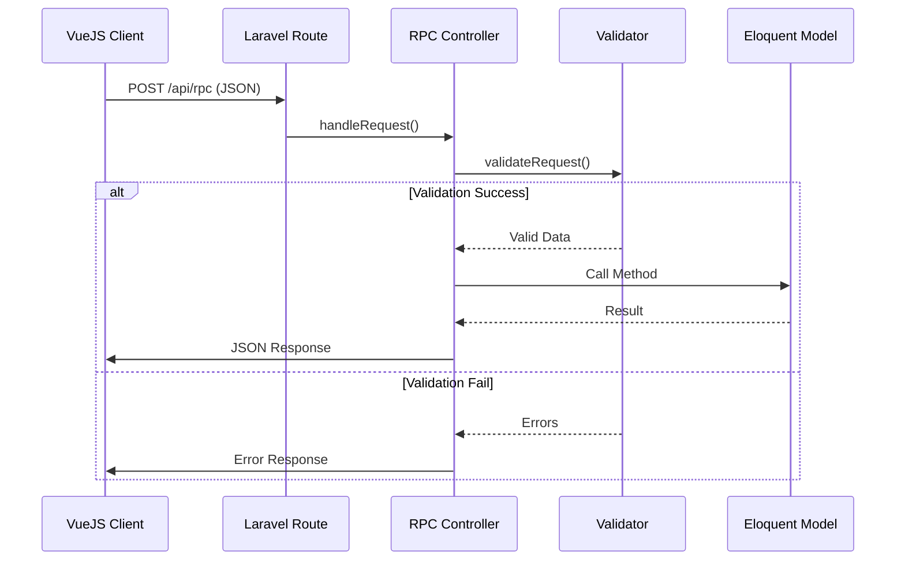

# RPC (Remote Procedure Call)

# Laravel ile RPC-style JSON API ve VueJS Entegrasyonu

## Temel Çalışma Mantığı

Laravel'de özel bir kütüphane kullanmadan RPC tarzı bir JSON API oluşturmak için şu adımları izleyebiliriz:

### 1. İstemci (VueJS) Tarafı

- VueJS'den Axios veya Fetch API kullanarak JSON formatında istek gönderilir
- İstek gövdesinde RPC tarzı bir yapı kullanılır (method adı ve parametreler)

### 2. Sunucu (Laravel) Tarafı

- Laravel rotası isteği karşılar ve bir controller'a yönlendirir
- Controller gelen JSON verisini parse eder
- Method adına göre uygun işlemi yapar
- Validasyonlar Laravel'in validation sistemini kullanarak yapılır
- Sonuç JSON formatında döndürülür

## Detaylı İşlem Akışı

### Mermaid Diagram



## Adım Adım Uygulama

### 1. VueJS (Client) Tarafı

```javascript
// RPCClient.js
import axios from 'axios';

export default {
  async call(method, params = {}) {
    try {
      const response = await axios.post('/api/rpc', {
        jsonrpc: '2.0',
        method: method,
        params: params,
        id: Date.now(), // Unique request ID
      });

      return response.data.result;
    } catch (error) {
      console.error('RPC Error:', error.response.data.error);
      throw error;
    }
  },
};
```

Kullanım örneği:

```javascript
// Component.vue
import RPCClient from '@/RPCClient';

export default {
  methods: {
    async fetchUser(userId) {
      try {
        const user = await RPCClient.call('getUser', { id: userId });
        // user kullan
      } catch (error) {
        // hata yönetimi
      }
    },
  },
};
```

### 2. Laravel (Server) Tarafı

#### Rota Tanımı

```php
// routes/api.php
Route::post('/rpc', 'RpcController@handle');
```

#### RPC Controller

```php
// app/Http/Controllers/RpcController.php
namespace App\Http\Controllers;

use Illuminate\Http\Request;
use Illuminate\Support\Facades\Validator;

class RpcController extends Controller
{
    public function handle(Request $request)
    {
        // Temel validasyon
        $validator = Validator::make($request->all(), [
            'jsonrpc' => 'required|in:2.0',
            'method' => 'required|string',
            'params' => 'nullable|array',
            'id' => 'required|numeric'
        ]);

        if ($validator->fails()) {
            return $this->errorResponse($validator->errors(), -32600);
        }

        $method = $request->input('method');
        $params = $request->input('params', []);
        $id = $request->input('id');

        try {
            $result = $this->callMethod($method, $params);
            return $this->successResponse($result, $id);
        } catch (\Exception $e) {
            return $this->errorResponse($e->getMessage(), -32603, $id);
        }
    }

    protected function callMethod($method, $params)
    {
        // Method mapping
        $methods = [
            'getUser' => ['validation' => [
                'id' => 'required|numeric'
            ], 'handler' => 'getUserHandler'],
            // Diğer methodlar...
        ];

        if (!array_key_exists($method, $methods)) {
            throw new \Exception('Method not found', -32601);
        }

        // Method-specific validation
        $validator = Validator::make($params, $methods[$method]['validation']);

        if ($validator->fails()) {
            throw new \Exception($validator->errors()->first(), -32602);
        }

        return $this->{$methods[$method]['handler']}($params);
    }

    protected function getUserHandler($params)
    {
        $user = \App\Models\User::find($params['id']);

        if (!$user) {
            throw new \Exception('User not found', -32604);
        }

        return [
            'id' => $user->id,
            'name' => $user->name,
            'email' => $user->email
        ];
    }

    protected function successResponse($result, $id)
    {
        return response()->json([
            'jsonrpc' => '2.0',
            'result' => $result,
            'id' => $id
        ]);
    }

    protected function errorResponse($message, $code, $id = null)
    {
        return response()->json([
            'jsonrpc' => '2.0',
            'error' => [
                'code' => $code,
                'message' => $message
            ],
            'id' => $id
        ], $this->getHttpStatusCode($code));
    }

    protected function getHttpStatusCode($errorCode)
    {
        $codes = [
            -32600 => 400, // Invalid Request
            -32601 => 404, // Method not found
            -32602 => 422, // Invalid params
            -32603 => 500, // Internal error
            -32604 => 404  // Not found
        ];

        return $codes[$errorCode] ?? 500;
    }
}
```

## Validasyon Süreci

1. **Temel RPC Validasyonu**: Gelen isteğin JSON-RPC 2.0 formatında olup olmadığı kontrol edilir
2. **Method Validasyonu**: İstenen methodun tanımlı olup olmadığı kontrol edilir
3. **Parametre Validasyonu**: Her method için özel validasyon kuralları uygulanır
4. **Business Logic Validasyon**: Method handler içinde özel kontroller yapılır (örneğin kullanıcı var mı)

## Response Yapısı

### Başarılı Yanıt

```json
{
  "jsonrpc": "2.0",
  "result": {
    "id": 1,
    "name": "John Doe",
    "email": "john@example.com"
  },
  "id": 123456789
}
```

### Hatalı Yanıt

```json
{
  "jsonrpc": "2.0",
  "error": {
    "code": -32602,
    "message": "The id field is required."
  },
  "id": 123456789
}
```

## Error Code Standartları

| Code   | Anlamı           | HTTP Status |
| ------ | ---------------- | ----------- |
| -32600 | Invalid Request  | 400         |
| -32601 | Method not found | 404         |
| -32602 | Invalid params   | 422         |
| -32603 | Internal error   | 500         |
| -32604 | Not found        | 404         |

## Gelişmiş Özellikler için İyileştirmeler

1. **Yetkilendirme**: Middleware ile JWT veya Sanctum entegrasyonu
2. **Logging**: Tüm RPC isteklerini loglama
3. **Rate Limiting**: Method bazında istek sınırlama
4. **Batch Requests**: Çoklu istek desteği
5. **Swagger Dökümantasyon**: API dökümantasyonu oluşturma

Bu yapı, Laravel'in sunduğu temel özelliklerle RPC tarzı bir API oluşturken iyi bir başlangıç noktası sağlar. Ölçeklenebilirlik için daha sonra gRPC veya JSON-RPC kütüphanelerine geçiş yapılabilir.

## Parametre olacak jsonrpc ve id neden kullanılır?

### **1. `"jsonrpc": "2.0"` Neden Kullanılır?**

- **Versiyon Belirtme**: Protokolün sürümünü tanımlar. Bu sayede:

  - İstemci/sunucu aynı protokol versiyonunu kullandığını doğrular.
  - Gelecekteki versiyonlarda geriye uyumluluk sağlanabilir.
  - Örnek: `3.0` çıkarsa, sunucu farklı davranış sergileyebilir.

- **Standardizasyon**: JSON-RPC 1.0, 2.0 ve diğer RPC formatlarından (XML-RPC gibi) ayrım yapmak için kullanılır.

### **2. `"id"` Alanı Neden Kullanılır?**

- **İstek-Yanıt Eşleştirme**: Özellikle asenkron iletişimde kritik öneme sahiptir.

  - İstemci aynı anda birden fazla istek gönderdiğinde, hangi yanıtın hangi isteğe ait olduğunu belirler.
  - Örnek:

    ```json
    // İstek 1
    {"id": 1, "method": "getUser", "params": {"id": 123}}

    // İstek 2
    {"id": 2, "method": "getOrders", "params": {"userId": 123}}

    // Yanıtlar
    {"id": 1, "result": {...}}  // İstek 1'in yanıtı
    {"id": 2, "result": [...]}  // İstek 2'nin yanıtı
    ```

- **Hata Takibi**: Hatalı yanıtlarda, hatanın hangi istekten kaynaklandığı belirlenebilir.
- **Notification Desteği**: Eğer `"id"` `null` ise, sunucu yanıt dönmez (notification olarak kabul edilir).

### **Özel Durumlar ve Kurallar**

1. **`"id"` Formatı**:

   - String, number veya `null` olabilir, ancak `null` sadece notification'lar için kullanılır.
   - Örnek: `"id": "req-123"`, `"id": 42`, `"id": null`

2. **Zorunlu Alanlar**:

   - Bir istekte `"jsonrpc"` ve `"method"` zorunludur.
   - Yanıtta `"jsonrpc"` ve `"id"` (hata durumunda `"error"`) zorunludur.

3. **Notification Örneği**:
   ```json
   // İstemci (yanıt beklemez)
   {
     "jsonrpc": "2.0",
     "method": "logEvent",
     "params": { "event": "click" },
     "id": null
   }
   ```

### **Neden Bu Yapı Tercih Edilir?**

- **Güvenilirlik**: İstemci, gönderdiği her isteğin takibini yapabilir.
- **Esneklik**: Hem senkron hem asenkron iletişimi destekler.
- **Standardizasyon**: Tüm JSON-RPC 2.0 uyumlu sistemler aynı kurallarla çalışır.

### **Alternatiflerle Karşılaştırma**

| Özellik          | JSON-RPC 2.0 | REST         | GraphQL        |
| ---------------- | ------------ | ------------ | -------------- |
| **İstek Takibi** | `id` alanı   | HTTP Headers | Query/mutation |
| **Versiyonlama** | `jsonrpc`    | URL/Header   | Schema         |

### **Sonuç**

- `"jsonrpc": "2.0"` → Protokolün versiyonunu ve tipini belirtir.
- `"id"` → İsteklerin izlenebilirliğini sağlar, çoklu isteklerde karışıklığı önler.

Bu standart sayesinde Laravel-VueJS entegrasyonunuz daha tutarlı ve hata ayıklanabilir olur.

**Referanslar:**

- [JSON-RPC Specification](https://jsonrpc.org/specification)
- [Sajya JSON-RPC](https://sajya.github.io/)
