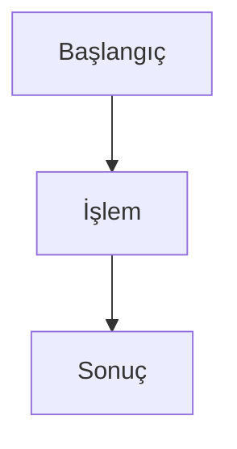
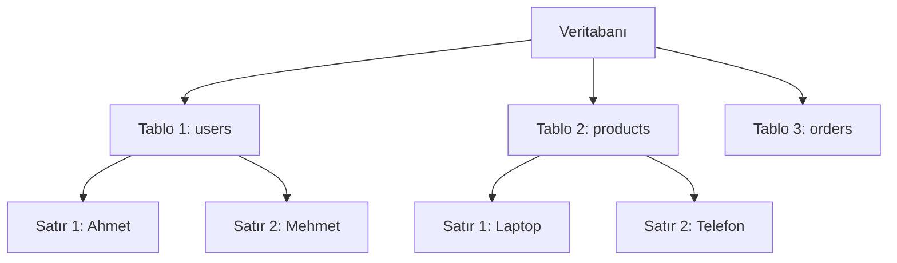
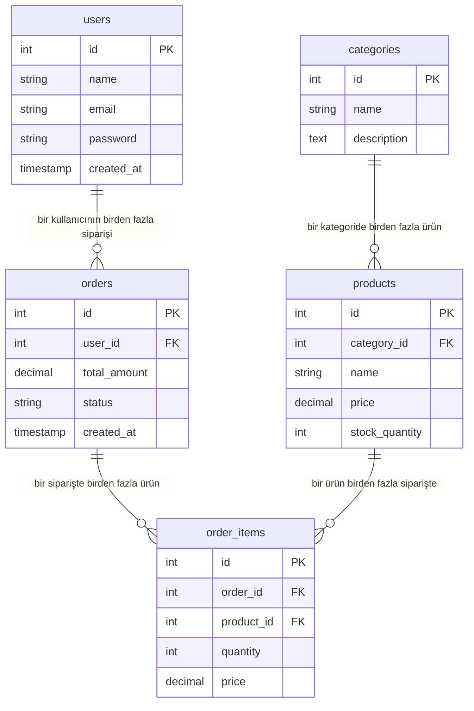
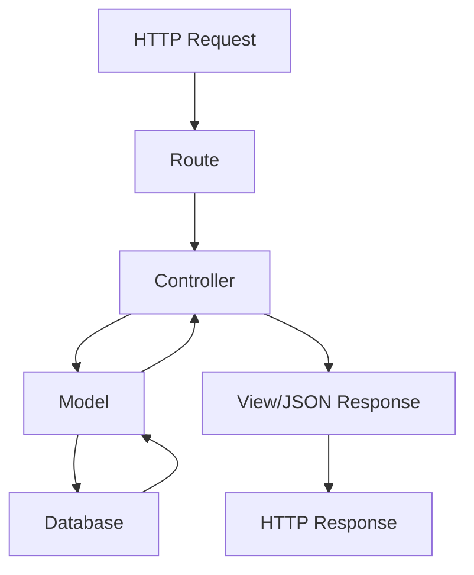
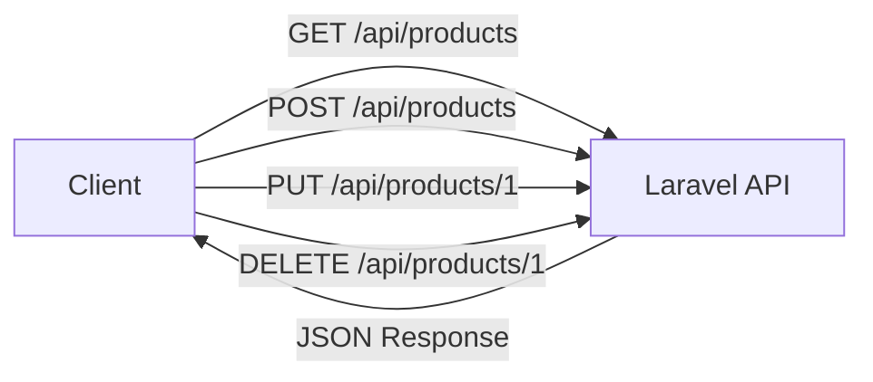
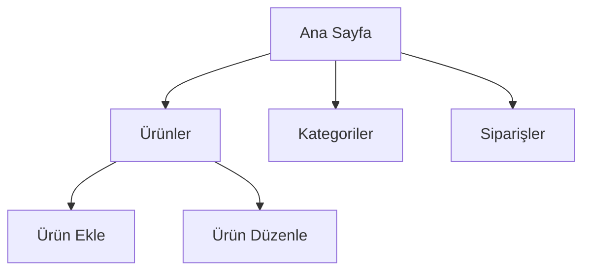
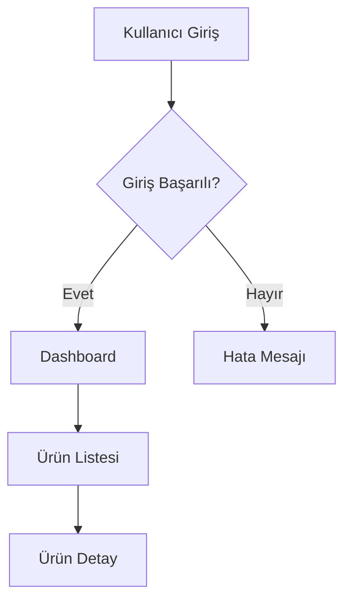

# PHP Laravel Vue.js Yapay Zeka Destekli Yazılım Geliştirme - Ders Notları

## 📌 Gün 1 Çalışma Ortamı Hazırlıkları

### Editör Kurulumu

- **VSCode**: Ücretsiz, güçlü kod editörü
- **Windsurf**: AI destekli kod editörü
- **Önerilen Extension'lar**:
  - PHP Extension Pack
  - Laravel Extension Pack
  - Vue Language Features (Vetur)
  - Prettier - Code formatter

### Araçlar Kurulumu

```bash
# Composer (PHP paket yöneticisi)
curl -sS https://getcomposer.org/installer | php
mv composer.phar /usr/local/bin/composer

# Git
git --version
git config --global user.name "İsim"
git config --global user.email "email@example.com"
```

### XAMPP/WAMP/MAMP Kurulumu

- Apache Web Server
- PHP 8.1+
- MySQL 8.0+
- phpMyAdmin

### Editör Kısayolları (VSCode)

- `Ctrl + Shift + P`: Komut paleti
- `Ctrl + /`: Yorum satırı
- `Ctrl + D`: Kelime seç
- `Alt + Shift + F`: Kod formatla
- `Ctrl + ` `: Terminal aç

### Markdown Temelleri

```markdown
# Başlık 1

## Başlık 2

**Kalın metin**
_İtalik metin_

- Liste öğesi
```

### Mermaid Diyagramları



### Yapay Zeka ve Prompt Kullanımı

- **Etkili Prompt Yazma**:
  - Açık ve net talimatlar
  - Örnekler verin
  - Bağlam belirtin
  - Adım adım talep edin

### Git Temelleri

```bash
git init                    # Yeni repo oluştur
git add .                   # Tüm dosyaları stage'e al
git commit -m "mesaj"       # Commit oluştur
git push origin main        # Uzak repo'ya gönder
git pull origin main        # Uzak repo'dan çek
```

---

## 📌 Gün 2 Veritabanı Temelleri ve MySQL Kurulumu

### 🎯 Gün 2 Hedefleri

- Veritabanı kavramlarını anlamak
- MySQL kurulumu ve phpMyAdmin kullanımı
- Temel SQL komutları
- Veri tipleri ve tablo yapısı

### Veritabanı Nedir?



### Temel Kavramlar

- **Veritabanı (Database)**: İlişkili verilerin organize edildiği yapı
- **Tablo (Table)**: Verilerin satır ve sütunlarda tutulduğu yapı
- **Satır (Row/Record)**: Tek bir kayıt (örn: bir kullanıcı)
- **Sütun (Column/Field)**: Veri alanı (örn: isim, email)
- **Birincil Anahtar (Primary Key)**: Her satırı benzersiz tanımlayan alan
- **Yabancı Anahtar (Foreign Key)**: Başka tabloya referans veren alan

### Veritabanı Yönetim Sistemleri

| DBMS           | Özellikler             | Kullanım Alanı    |
| -------------- | ---------------------- | ----------------- |
| **MySQL**      | Açık kaynak, hızlı     | Web uygulamaları  |
| **PostgreSQL** | Gelişmiş özellikler    | Kurumsal projeler |
| **SQLite**     | Dosya tabanlı          | Küçük uygulamalar |
| **MongoDB**    | NoSQL, döküman tabanlı | Büyük veri        |

### MySQL Kurulumu ve Yapılandırma

```bash
# Ubuntu/Debian
sudo apt update
sudo apt install mysql-server
sudo mysql_secure_installation

# Windows: XAMPP kullanın
# macOS: MAMP kullanın
```

### phpMyAdmin Kullanımı

1. **Erişim**: `http://localhost/phpmyadmin`
2. **Veritabanı Oluşturma**: Sol panel → "Yeni"
3. **Tablo Oluşturma**: Veritabanı seç → "Yeni tablo"
4. **Veri Ekleme**: Tablo seç → "Ekle"
5. **SQL Sorguları**: "SQL" sekmesi

### Veri Tipleri Detaylı

```sql
-- Sayısal Tipler
TINYINT         -- -128 ile 127 arası
SMALLINT        -- -32,768 ile 32,767 arası
MEDIUMINT       -- -8,388,608 ile 8,388,607 arası
INT             -- -2,147,483,648 ile 2,147,483,647 arası
BIGINT          -- Çok büyük sayılar

-- Metin Tipler
CHAR(n)         -- Sabit uzunluk (max 255)
VARCHAR(n)      -- Değişken uzunluk (max 65,535)
TEXT            -- Uzun metin (max 65,535)
LONGTEXT        -- Çok uzun metin (max 4GB)

-- Tarih ve Saat
DATE            -- YYYY-MM-DD formatında tarih
TIME            -- HH:MM:SS formatında saat
DATETIME        -- YYYY-MM-DD HH:MM:SS
TIMESTAMP       -- Unix timestamp
YEAR            -- YYYY formatında yıl

-- Diğer Tipler
DECIMAL(p,s)    -- Ondalık sayı (p:toplam basamak, s:ondalık)
FLOAT           -- Kayan noktalı sayı
DOUBLE          -- Çift hassasiyetli sayı
BOOLEAN         -- TRUE/FALSE (TINYINT(1) olarak saklanır)
ENUM('a','b')   -- Seçenekler arası seçim
```

### İlk Veritabanı ve Tablo Oluşturma

```sql
-- 1. Veritabanı oluştur
CREATE DATABASE ecommerce_db;

-- 2. Veritabanını seç
USE ecommerce_db;

-- 3. Kullanıcılar tablosu
CREATE TABLE users (
    id INT AUTO_INCREMENT PRIMARY KEY,
    name VARCHAR(100) NOT NULL,
    email VARCHAR(150) UNIQUE NOT NULL,
    password VARCHAR(255) NOT NULL,
    phone VARCHAR(20),
    address TEXT,
    is_active BOOLEAN DEFAULT TRUE,
    created_at TIMESTAMP DEFAULT CURRENT_TIMESTAMP,
    updated_at TIMESTAMP DEFAULT CURRENT_TIMESTAMP ON UPDATE CURRENT_TIMESTAMP
);

-- 4. Kategoriler tablosu
CREATE TABLE categories (
    id INT AUTO_INCREMENT PRIMARY KEY,
    name VARCHAR(100) NOT NULL,
    description TEXT,
    is_active BOOLEAN DEFAULT TRUE,
    created_at TIMESTAMP DEFAULT CURRENT_TIMESTAMP
);

-- 5. Ürünler tablosu
CREATE TABLE products (
    id INT AUTO_INCREMENT PRIMARY KEY,
    category_id INT,
    name VARCHAR(200) NOT NULL,
    description TEXT,
    price DECIMAL(10,2) NOT NULL,
    stock_quantity INT DEFAULT 0,
    image_url VARCHAR(255),
    is_active BOOLEAN DEFAULT TRUE,
    created_at TIMESTAMP DEFAULT CURRENT_TIMESTAMP,
    updated_at TIMESTAMP DEFAULT CURRENT_TIMESTAMP ON UPDATE CURRENT_TIMESTAMP,
    FOREIGN KEY (category_id) REFERENCES categories(id)
);
```

### Temel SQL Komutları - Pratik Örnekler

```sql
-- VERİ EKLEME (INSERT)
INSERT INTO categories (name, description) VALUES
('Elektronik', 'Elektronik ürünler'),
('Giyim', 'Giyim ürünleri'),
('Kitap', 'Kitap ve dergi');

INSERT INTO users (name, email, password, phone) VALUES
('Ahmet Yılmaz', 'ahmet@example.com', 'hashed_password', '0532 123 45 67'),
('Ayşe Kaya', 'ayse@example.com', 'hashed_password', '0533 987 65 43');

INSERT INTO products (category_id, name, description, price, stock_quantity) VALUES
(1, 'iPhone 14', 'Apple iPhone 14 128GB', 25000.00, 10),
(1, 'Samsung Galaxy S23', 'Samsung Galaxy S23 256GB', 22000.00, 15),
(2, 'Nike Air Max', 'Nike spor ayakkabı', 800.00, 50);

-- VERİ OKUMA (SELECT)
-- Tüm ürünleri listele
SELECT * FROM products;

-- Belirli sütunları seç
SELECT name, price FROM products;

-- Şartlı sorgular
SELECT * FROM products WHERE price > 1000;
SELECT * FROM products WHERE category_id = 1;
SELECT * FROM products WHERE name LIKE '%iPhone%';

-- Sıralama
SELECT * FROM products ORDER BY price DESC;
SELECT * FROM products ORDER BY name ASC;

-- Limit kullanımı
SELECT * FROM products LIMIT 5;
SELECT * FROM products LIMIT 5 OFFSET 10;

-- VERİ GÜNCELLEME (UPDATE)
UPDATE products SET price = 24000.00 WHERE id = 1;
UPDATE products SET stock_quantity = stock_quantity - 1 WHERE id = 2;
UPDATE users SET is_active = FALSE WHERE email = 'ahmet@example.com';

-- VERİ SİLME (DELETE)
DELETE FROM products WHERE id = 3;
DELETE FROM users WHERE is_active = FALSE;
```

### Pratik Alıştırmalar - Gün 2

1. **ecommerce_db** veritabanını oluşturun
2. **users**, **categories**, **products** tablolarını oluşturun
3. Her tabloya 5'er adet örnek veri ekleyin
4. Farklı SELECT sorguları yazın
5. Veri güncelleme ve silme işlemleri yapın

---

## 📌 Gün 3 Gelişmiş SQL Sorguları ve İlişkisel Veritabanı

### 🎯 Gün 3 Hedefleri

- JOIN işlemleri
- Aggregate fonksiyonlar
- İlişkisel veritabanı tasarımı
- İndeks kullanımı
- Karmaşık sorgular

### İlişkisel Veritabanı Tasarımı



### Eksik Tabloları Oluşturma

```sql
-- Siparişler tablosu
CREATE TABLE orders (
    id INT AUTO_INCREMENT PRIMARY KEY,
    user_id INT NOT NULL,
    total_amount DECIMAL(10,2) NOT NULL,
    status ENUM('pending', 'processing', 'shipped', 'delivered', 'cancelled') DEFAULT 'pending',
    shipping_address TEXT,
    created_at TIMESTAMP DEFAULT CURRENT_TIMESTAMP,
    updated_at TIMESTAMP DEFAULT CURRENT_TIMESTAMP ON UPDATE CURRENT_TIMESTAMP,
    FOREIGN KEY (user_id) REFERENCES users(id) ON DELETE CASCADE
);

-- Sipariş öğeleri tablosu
CREATE TABLE order_items (
    id INT AUTO_INCREMENT PRIMARY KEY,
    order_id INT NOT NULL,
    product_id INT NOT NULL,
    quantity INT NOT NULL,
    price DECIMAL(10,2) NOT NULL,
    FOREIGN KEY (order_id) REFERENCES orders(id) ON DELETE CASCADE,
    FOREIGN KEY (product_id) REFERENCES products(id) ON DELETE CASCADE
);
```

### Örnek Veriler Ekleme

```sql
-- Siparişler
INSERT INTO orders (user_id, total_amount, status, shipping_address) VALUES
(1, 25800.00, 'delivered', 'İstanbul, Kadıköy'),
(2, 22000.00, 'processing', 'Ankara, Çankaya'),
(1, 800.00, 'pending', 'İstanbul, Kadıköy');

-- Sipariş öğeleri
INSERT INTO order_items (order_id, product_id, quantity, price) VALUES
(1, 1, 1, 25000.00),  -- iPhone 14
(1, 3, 1, 800.00),    -- Nike Air Max
(2, 2, 1, 22000.00),  -- Samsung Galaxy S23
(3, 3, 1, 800.00);    -- Nike Air Max
```

### JOIN İşlemleri

```sql
-- INNER JOIN - Sadece eşleşen kayıtlar
SELECT
    p.name AS product_name,
    c.name AS category_name,
    p.price
FROM products p
INNER JOIN categories c ON p.category_id = c.id;

-- LEFT JOIN - Sol tablodaki tüm kayıtlar
SELECT
    u.name AS user_name,
    o.total_amount,
    o.status
FROM users u
LEFT JOIN orders o ON u.id = o.user_id;

-- RIGHT JOIN - Sağ tablodaki tüm kayıtlar
SELECT
    u.name AS user_name,
    o.total_amount
FROM users u
RIGHT JOIN orders o ON u.id = o.user_id;

-- Çoklu JOIN
SELECT
    u.name AS customer_name,
    o.id AS order_id,
    p.name AS product_name,
    oi.quantity,
    oi.price
FROM users u
JOIN orders o ON u.id = o.user_id
JOIN order_items oi ON o.id = oi.order_id
JOIN products p ON oi.product_id = p.id;
```

### Aggregate Fonksiyonlar

```sql
-- COUNT - Kayıt sayısı
SELECT COUNT(*) AS total_users FROM users;
SELECT COUNT(*) AS total_products FROM products WHERE price > 1000;

-- SUM - Toplam
SELECT SUM(total_amount) AS total_revenue FROM orders;
SELECT SUM(stock_quantity) AS total_stock FROM products;

-- AVG - Ortalama
SELECT AVG(price) AS average_price FROM products;
SELECT AVG(total_amount) AS average_order_value FROM orders;

-- MIN ve MAX - En küçük ve en büyük değer
SELECT MIN(price) AS cheapest_product FROM products;
SELECT MAX(total_amount) AS largest_order FROM orders;

-- GROUP BY ile gruplama
SELECT
    c.name AS category_name,
    COUNT(p.id) AS product_count,
    AVG(p.price) AS average_price
FROM categories c
LEFT JOIN products p ON c.id = p.category_id
GROUP BY c.id, c.name;

-- HAVING - Gruplar için şart
SELECT
    c.name AS category_name,
    COUNT(p.id) AS product_count
FROM categories c
LEFT JOIN products p ON c.id = p.category_id
GROUP BY c.id, c.name
HAVING COUNT(p.id) > 0;
```

### Karmaşık Sorgular

```sql
-- Alt sorgu (Subquery)
SELECT name, price FROM products
WHERE price > (SELECT AVG(price) FROM products);

-- En çok satan ürünler
SELECT
    p.name,
    SUM(oi.quantity) AS total_sold
FROM products p
JOIN order_items oi ON p.id = oi.product_id
GROUP BY p.id, p.name
ORDER BY total_sold DESC;

-- Müşteri bazında sipariş özeti
SELECT
    u.name AS customer_name,
    COUNT(o.id) AS order_count,
    SUM(o.total_amount) AS total_spent,
    AVG(o.total_amount) AS average_order_value
FROM users u
LEFT JOIN orders o ON u.id = o.user_id
GROUP BY u.id, u.name;

-- Kategori bazında satış raporu
SELECT
    c.name AS category_name,
    COUNT(DISTINCT oi.order_id) AS order_count,
    SUM(oi.quantity) AS total_quantity,
    SUM(oi.price * oi.quantity) AS total_revenue
FROM categories c
JOIN products p ON c.id = p.category_id
JOIN order_items oi ON p.id = oi.product_id
GROUP BY c.id, c.name
ORDER BY total_revenue DESC;
```

### İndeks Kullanımı

```sql
-- İndeks oluşturma
CREATE INDEX idx_product_name ON products(name);
CREATE INDEX idx_user_email ON users(email);
CREATE INDEX idx_order_date ON orders(created_at);

-- Kompozit indeks
CREATE INDEX idx_product_category_price ON products(category_id, price);

-- İndeks silme
DROP INDEX idx_product_name ON products;

-- İndeksleri görüntüleme
SHOW INDEX FROM products;
```

### Veritabanı Yedekleme ve Geri Yükleme

```bash
# Yedekleme
mysqldump -u root -p ecommerce_db > ecommerce_backup.sql

# Geri yükleme
mysql -u root -p ecommerce_db < ecommerce_backup.sql
```

### Pratik Alıştırmalar - Gün 3

```sql
-- 1. Tüm siparişleri müşteri adı ile birlikte listeleyin
SELECT u.name, o.id, o.total_amount, o.status
FROM users u
JOIN orders o ON u.id = o.user_id;

-- 2. Her kategorideki ürün sayısını bulun
SELECT c.name, COUNT(p.id) as product_count
FROM categories c
LEFT JOIN products p ON c.id = p.category_id
GROUP BY c.id;

-- 3. En pahalı 3 ürünü listeleyin
SELECT name, price FROM products ORDER BY price DESC LIMIT 3;

-- 4. Hiç sipariş vermeyen kullanıcıları bulun
SELECT u.name FROM users u
LEFT JOIN orders o ON u.id = o.user_id
WHERE o.id IS NULL;

-- 5. Her ay kaç sipariş verildiğini bulun
SELECT
    YEAR(created_at) as year,
    MONTH(created_at) as month,
    COUNT(*) as order_count
FROM orders
GROUP BY YEAR(created_at), MONTH(created_at);
```

### Performans İpuçları

- **İndeks Kullanın**: Sık aranan sütunlara indeks ekleyin
- **SELECT \* Kullanmayın**: Sadece ihtiyacınız olan sütunları seçin
- **LIMIT Kullanın**: Büyük veri setlerinde sayfalama yapın
- **JOIN Optimize Edin**: Gereksiz JOIN'lerden kaçının
- **WHERE Şartları**: Önce en seçici şartları yazın

### Gün 2-3 Özet Kontrol Listesi

- [ ] MySQL kurulumu tamamlandı
- [ ] phpMyAdmin'e erişim sağlandı
- [ ] Temel SQL komutları öğrenildi
- [ ] İlişkisel veritabanı tasarımı anlaşıldı
- [ ] JOIN işlemleri uygulandı
- [ ] Aggregate fonksiyonlar kullanıldı
- [ ] Karmaşık sorgular yazıldı
- [ ] İndeks kavramı öğrenildi

---

## 📌 Gün 4 Laravel Temelleri ve Proje Kurulumu

### 🎯 Gün 4 Hedefleri

- Laravel framework'ü tanımak
- MVC mimarisini anlamak
- Laravel projesi oluşturmak
- Migration ve Model yapısını öğrenmek
- Temel CRUD işlemlerini yapmak

### Laravel Nedir?

Laravel, PHP için geliştirilmiş modern bir web framework'üdür.



### Laravel'in Avantajları

- **Eloquent ORM**: Veritabanı işlemleri için güçlü ORM
- **Artisan CLI**: Komut satırı aracı
- **Blade Template**: Template engine
- **Migration**: Veritabanı versiyonlama
- **Middleware**: İstek filtreleme
- **Authentication**: Hazır kimlik doğrulama
- **Queue**: Arka plan işlemleri

### Gereksinimler ve Kurulum

```bash
# PHP versiyonu kontrolü
php -v  # PHP 8.1+ gerekli

# Composer versiyonu
composer --version

# Laravel installer (opsiyonel)
composer global require laravel/installer
```

### Proje Oluşturma

```bash
# Composer ile
composer create-project laravel/laravel ecommerce-api
cd ecommerce-api

# Laravel installer ile (eğer kuruluysa)
laravel new ecommerce-api
cd ecommerce-api

# Geliştirme sunucusunu başlat
php artisan serve
# http://localhost:8000
```

### Laravel Proje Yapısı

```
ecommerce-api/
├── app/
│   ├── Http/
│   │   ├── Controllers/    # Controller sınıfları
│   │   ├── Middleware/     # Middleware sınıfları
│   │   └── Requests/       # Form request sınıfları
│   ├── Models/             # Eloquent model sınıfları
│   └── Providers/          # Service provider sınıfları
├── bootstrap/              # Framework başlatma dosyaları
├── config/                 # Yapılandırma dosyaları
├── database/
│   ├── migrations/         # Veritabanı migration dosyaları
│   ├── seeders/           # Veritabanı seed dosyaları
│   └── factories/         # Model factory dosyaları
├── public/                 # Web erişilebilir dosyalar
├── resources/
│   ├── views/             # Blade template dosyaları
│   └── js/                # JavaScript dosyaları
├── routes/
│   ├── api.php            # API rotaları
│   └── web.php            # Web rotaları
├── storage/               # Loglar, cache, dosyalar
└── tests/                 # Test dosyaları
```

### Ortam Yapılandırması (.env)

```bash
# .env dosyasını kopyala
cp .env.example .env

# Uygulama anahtarı oluştur
php artisan key:generate
```

```env
# .env dosyası
APP_NAME=ECommerce-API
APP_ENV=local
APP_KEY=base64:generated_key_here
APP_DEBUG=true
APP_URL=http://localhost:8000

# Veritabanı ayarları
DB_CONNECTION=mysql
DB_HOST=127.0.0.1
DB_PORT=3306
DB_DATABASE=ecommerce_db
DB_USERNAME=root
DB_PASSWORD=your_password
```

### Artisan CLI Komutları

```bash
# Genel yardım
php artisan

# Proje bilgisi
php artisan about

# Route listesi
php artisan route:list

# Migration çalıştır
php artisan migrate

# Cache temizle
php artisan cache:clear
php artisan config:clear
php artisan route:clear

# Optimize
php artisan optimize
```

### Migration Oluşturma ve Kullanımı

```bash
# Migration oluştur
php artisan make:migration create_categories_table
php artisan make:migration create_products_table
php artisan make:migration create_orders_table
php artisan make:migration create_order_items_table
```

```php
// database/migrations/xxxx_create_categories_table.php
<?php

use Illuminate\Database\Migrations\Migration;
use Illuminate\Database\Schema\Blueprint;
use Illuminate\Support\Facades\Schema;

return new class extends Migration
{
    public function up()
    {
        Schema::create('categories', function (Blueprint $table) {
            $table->id();
            $table->string('name');
            $table->text('description')->nullable();
            $table->boolean('is_active')->default(true);
            $table->timestamps();
        });
    }

    public function down()
    {
        Schema::dropIfExists('categories');
    }
};
```

```php
// database/migrations/xxxx_create_products_table.php
<?php

use Illuminate\Database\Migrations\Migration;
use Illuminate\Database\Schema\Blueprint;
use Illuminate\Support\Facades\Schema;

return new class extends Migration
{
    public function up()
    {
        Schema::create('products', function (Blueprint $table) {
            $table->id();
            $table->foreignId('category_id')->constrained()->onDelete('cascade');
            $table->string('name');
            $table->text('description')->nullable();
            $table->decimal('price', 10, 2);
            $table->integer('stock_quantity')->default(0);
            $table->string('image_url')->nullable();
            $table->boolean('is_active')->default(true);
            $table->timestamps();
        });
    }

    public function down()
    {
        Schema::dropIfExists('products');
    }
};
```

### Model Oluşturma

```bash
# Model oluştur
php artisan make:model Category
php artisan make:model Product
php artisan make:model Order
php artisan make:model OrderItem

# Model + Migration + Controller + Factory + Seeder tek komutla
php artisan make:model Product -mcfs
```

```php
// app/Models/Category.php
<?php

namespace App\Models;

use Illuminate\Database\Eloquent\Factories\HasFactory;
use Illuminate\Database\Eloquent\Model;

class Category extends Model
{
    use HasFactory;

    protected $fillable = [
        'name',
        'description',
        'is_active'
    ];

    protected $casts = [
        'is_active' => 'boolean'
    ];

    // İlişkiler
    public function products()
    {
        return $this->hasMany(Product::class);
    }
}
```

```php
// app/Models/Product.php
<?php

namespace App\Models;

use Illuminate\Database\Eloquent\Factories\HasFactory;
use Illuminate\Database\Eloquent\Model;

class Product extends Model
{
    use HasFactory;

    protected $fillable = [
        'category_id',
        'name',
        'description',
        'price',
        'stock_quantity',
        'image_url',
        'is_active'
    ];

    protected $casts = [
        'price' => 'decimal:2',
        'is_active' => 'boolean'
    ];

    // İlişkiler
    public function category()
    {
        return $this->belongsTo(Category::class);
    }

    public function orderItems()
    {
        return $this->hasMany(OrderItem::class);
    }

    // Accessor - Fiyatı formatla
    public function getFormattedPriceAttribute()
    {
        return number_format($this->price, 2) . ' TL';
    }

    // Scope - Aktif ürünler
    public function scopeActive($query)
    {
        return $query->where('is_active', true);
    }

    // Scope - Stokta olan ürünler
    public function scopeInStock($query)
    {
        return $query->where('stock_quantity', '>', 0);
    }
}
```

### Database Seeder ile Örnek Veri

```bash
# Seeder oluştur
php artisan make:seeder CategorySeeder
php artisan make:seeder ProductSeeder
```

```php
// database/seeders/CategorySeeder.php
<?php

namespace Database\Seeders;

use App\Models\Category;
use Illuminate\Database\Seeder;

class CategorySeeder extends Seeder
{
    public function run()
    {
        $categories = [
            [
                'name' => 'Elektronik',
                'description' => 'Elektronik ürünler ve aksesuarlar',
                'is_active' => true
            ],
            [
                'name' => 'Giyim',
                'description' => 'Giyim ve moda ürünleri',
                'is_active' => true
            ],
            [
                'name' => 'Ev & Yaşam',
                'description' => 'Ev ve yaşam ürünleri',
                'is_active' => true
            ],
            [
                'name' => 'Kitap',
                'description' => 'Kitap ve dergi',
                'is_active' => true
            ]
        ];

        foreach ($categories as $category) {
            Category::create($category);
        }
    }
}
```

```php
// database/seeders/ProductSeeder.php
<?php

namespace Database\Seeders;

use App\Models\Product;
use Illuminate\Database\Seeder;

class ProductSeeder extends Seeder
{
    public function run()
    {
        $products = [
            [
                'category_id' => 1,
                'name' => 'iPhone 14',
                'description' => 'Apple iPhone 14 128GB',
                'price' => 25000.00,
                'stock_quantity' => 10,
                'is_active' => true
            ],
            [
                'category_id' => 1,
                'name' => 'Samsung Galaxy S23',
                'description' => 'Samsung Galaxy S23 256GB',
                'price' => 22000.00,
                'stock_quantity' => 15,
                'is_active' => true
            ],
            [
                'category_id' => 2,
                'name' => 'Nike Air Max',
                'description' => 'Nike spor ayakkabı',
                'price' => 800.00,
                'stock_quantity' => 50,
                'is_active' => true
            ],
            [
                'category_id' => 3,
                'name' => 'Kahve Makinesi',
                'description' => 'Otomatik kahve makinesi',
                'price' => 1500.00,
                'stock_quantity' => 20,
                'is_active' => true
            ],
            [
                'category_id' => 4,
                'name' => 'Laravel Kitabı',
                'description' => 'Laravel ile Web Geliştirme',
                'price' => 120.00,
                'stock_quantity' => 100,
                'is_active' => true
            ]
        ];

        foreach ($products as $product) {
            Product::create($product);
        }
    }
}
```

```php
// database/seeders/DatabaseSeeder.php
<?php

namespace Database\Seeders;

use Illuminate\Database\Seeder;

class DatabaseSeeder extends Seeder
{
    public function run()
    {
        $this->call([
            CategorySeeder::class,
            ProductSeeder::class,
        ]);
    }
}
```

### Migration ve Seed Çalıştırma

```bash
# Migration çalıştır
php artisan migrate

# Seed çalıştır
php artisan db:seed

# Migration + Seed beraber
php artisan migrate:fresh --seed

# Belirli seeder çalıştır
php artisan db:seed --class=CategorySeeder
```

### Tinker ile Model Test

```bash
# Tinker başlat
php artisan tinker

# Model test komutları
>>> Category::all()
>>> Category::find(1)
>>> Category::where('name', 'Elektronik')->first()
>>> Product::with('category')->get()
>>> Product::active()->inStock()->get()
>>> Category::find(1)->products
```

### Gün 4 Pratik Alıştırmaları

1. **Proje Kurulumu**: Laravel projesini kurun ve çalıştırın
2. **Veritabanı Bağlantısı**: .env dosyasını düzenleyin
3. **Migration Oluşturma**: Tüm tabloları migration ile oluşturun
4. **Model Tanımlama**: Tüm model sınıflarını oluşturun
5. **Seeder Hazırlama**: Örnek verileri ekleyin
6. **Tinker Test**: Model ilişkilerini test edin

---

## 📌 Gün 5 Laravel REST API Geliştirme

### 🎯 Gün 5 Hedefleri

- REST API prensiplerini anlamak
- Controller oluşturmak
- Route tanımlamak
- JSON response üretmek
- Request validation yapmak
- API test etmek

### REST API Nedir?

REST (Representational State Transfer) bir mimari stildir.



### HTTP Metotları ve CRUD

| HTTP Metot | CRUD İşlem | Açıklama        | Örnek URL              |
| ---------- | ---------- | --------------- | ---------------------- |
| GET        | Read       | Veri okuma      | GET /api/products      |
| POST       | Create     | Veri oluşturma  | POST /api/products     |
| PUT        | Update     | Veri güncelleme | PUT /api/products/1    |
| DELETE     | Delete     | Veri silme      | DELETE /api/products/1 |

### Controller Oluşturma

```bash
# API Controller oluştur
php artisan make:controller Api/CategoryController --api
php artisan make:controller Api/ProductController --api
```

```php
// app/Http/Controllers/Api/CategoryController.php
<?php

namespace App\Http\Controllers\Api;

use App\Http\Controllers\Controller;
use App\Models\Category;
use Illuminate\Http\Request;
use Illuminate\Http\Response;

class CategoryController extends Controller
{
    /**
     * Tüm kategorileri listele
     */
    public function index()
    {
        $categories = Category::with('products')->get();

        return response()->json([
            'success' => true,
            'data' => $categories,
            'message' => 'Kategoriler başarıyla listelendi'
        ]);
    }

    /**
     * Yeni kategori oluştur
     */
    public function store(Request $request)
    {
        $request->validate([
            'name' => 'required|string|max:255|unique:categories',
            'description' => 'nullable|string',
            'is_active' => 'boolean'
        ]);

        $category = Category::create($request->all());

        return response()->json([
            'success' => true,
            'data' => $category,
            'message' => 'Kategori başarıyla oluşturuldu'
        ], Response::HTTP_CREATED);
    }

    /**
     * Belirli kategoriyi göster
     */
    public function show(Category $category)
    {
        $category->load('products');

        return response()->json([
            'success' => true,
            'data' => $category,
            'message' => 'Kategori başarıyla getirildi'
        ]);
    }

    /**
     * Kategori güncelle
     */
    public function update(Request $request, Category $category)
    {
        $request->validate([
            'name' => 'required|string|max:255|unique:categories,name,' . $category->id,
            'description' => 'nullable|string',
            'is_active' => 'boolean'
        ]);

        $category->update($request->all());

        return response()->json([
            'success' => true,
            'data' => $category,
            'message' => 'Kategori başarıyla güncellendi'
        ]);
    }

    /**
     * Kategori sil
     */
    public function destroy(Category $category)
    {
        // Kategoriye ait ürün var mı kontrol et
        if ($category->products()->exists()) {
            return response()->json([
                'success' => false,
                'message' => 'Bu kategoriye ait ürünler bulunmaktadır. Önce ürünleri silin.'
            ], Response::HTTP_CONFLICT);
        }

        $category->delete();

        return response()->json([
            'success' => true,
            'message' => 'Kategori başarıyla silindi'
        ]);
    }
}
```

```php
// app/Http/Controllers/Api/ProductController.php
<?php

namespace App\Http\Controllers\Api;

use App\Http\Controllers\Controller;
use App\Models\Product;
use Illuminate\Http\Request;
use Illuminate\Http\Response;

class ProductController extends Controller
{
    /**
     * Tüm ürünleri listele
     */
    public function index(Request $request)
    {
        $query = Product::with('category');

        // Filtreleme
        if ($request->has('category_id')) {
            $query->where('category_id', $request->category_id);
        }

        if ($request->has('search')) {
            $query->where('name', 'like', '%' . $request->search . '%');
        }

        if ($request->has('min_price')) {
            $query->where('price', '>=', $request->min_price);
        }

        if ($request->has('max_price')) {
            $query->where('price', '<=', $request->max_price);
        }

        // Sadece aktif ürünler
        if ($request->has('active_only')) {
            $query->active();
        }

        // Sıralama
        $sortBy = $request->get('sort_by', 'created_at');
        $sortDirection = $request->get('sort_direction', 'desc');
        $query->orderBy($sortBy, $sortDirection);

        // Sayfalama
        $perPage = $request->get('per_page', 10);
        $products = $query->paginate($perPage);

        return response()->json([
            'success' => true,
            'data' => $products,
            'message' => 'Ürünler başarıyla listelendi'
        ]);
    }

    /**
     * Yeni ürün oluştur
     */
    public function store(Request $request)
    {
        $request->validate([
            'category_id' => 'required|exists:categories,id',
            'name' => 'required|string|max:255',
            'description' => 'nullable|string',
            'price' => 'required|numeric|min:0',
            'stock_quantity' => 'required|integer|min:0',
            'image_url' => 'nullable|url',
            'is_active' => 'boolean'
        ]);

        $product = Product::create($request->all());
        $product->load('category');

        return response()->json([
            'success' => true,
            'data' => $product,
            'message' => 'Ürün başarıyla oluşturuldu'
        ], Response::HTTP_CREATED);
    }

    /**
     * Belirli ürünü göster
     */
    public function show(Product $product)
    {
        $product->load('category');

        return response()->json([
            'success' => true,
            'data' => $product,
            'message' => 'Ürün başarıyla getirildi'
        ]);
    }

    /**
     * Ürün güncelle
     */
    public function update(Request $request, Product $product)
    {
        $request->validate([
            'category_id' => 'required|exists:categories,id',
            'name' => 'required|string|max:255',
            'description' => 'nullable|string',
            'price' => 'required|numeric|min:0',
            'stock_quantity' => 'required|integer|min:0',
            'image_url' => 'nullable|url',
            'is_active' => 'boolean'
        ]);

        $product->update($request->all());
        $product->load('category');

        return response()->json([
            'success' => true,
            'data' => $product,
            'message' => 'Ürün başarıyla güncellendi'
        ]);
    }

    /**
     * Ürün sil
     */
    public function destroy(Product $product)
    {
        // Siparişlerde kullanılıyor mu kontrol et
        if ($product->orderItems()->exists()) {
            return response()->json([
                'success' => false,
                'message' => 'Bu ürün siparişlerde kullanılmaktadır. Silinemez.'
            ], Response::HTTP_CONFLICT);
        }

        $product->delete();

        return response()->json([
            'success' => true,
            'message' => 'Ürün başarıyla silindi'
        ]);
    }
}
```

### Route Tanımlama

```php
// routes/api.php
<?php

use Illuminate\Http\Request;
use Illuminate\Support\Facades\Route;
use App\Http\Controllers\Api\CategoryController;
use App\Http\Controllers\Api\ProductController;

/*
|--------------------------------------------------------------------------
| API Routes
|--------------------------------------------------------------------------
*/

// API versiyonlama
Route::prefix('v1')->group(function () {

    // Kategori rotaları
    Route::apiResource('categories', CategoryController::class);

    // Ürün rotaları
    Route::apiResource('products', ProductController::class);

    // Özel rotalar
    Route::get('categories/{category}/products', function (Category $category) {
        return response()->json([
            'success' => true,
            'data' => $category->products,
            'message' => 'Kategori ürünleri başarıyla getirildi'
        ]);
    });
});

// Genel API bilgisi
Route::get('/', function () {
    return response()->json([
        'app' => 'E-Commerce API',
        'version' => '1.0.0',
        'message' => 'API çalışıyor'
    ]);
});
```

### Form Request Validation

```bash
# Form Request oluştur
php artisan make:request StoreProductRequest
php artisan make:request UpdateProductRequest
```

```php
// app/Http/Requests/StoreProductRequest.php
<?php

namespace App\Http\Requests;

use Illuminate\Foundation\Http\FormRequest;

class StoreProductRequest extends FormRequest
{
    public function authorize()
    {
        return true;
    }

    public function rules()
    {
        return [
            'category_id' => 'required|exists:categories,id',
            'name' => 'required|string|max:255',
            'description' => 'nullable|string|max:1000',
            'price' => 'required|numeric|min:0|max:999999.99',
            'stock_quantity' => 'required|integer|min:0',
            'image_url' => 'nullable|url|max:500',
            'is_active' => 'boolean'
        ];
    }

    public function messages()
    {
        return [
            'category_id.required' => 'Kategori seçimi zorunludur',
            'category_id.exists' => 'Seçilen kategori geçersiz',
            'name.required' => 'Ürün adı zorunludur',
            'name.max' => 'Ürün adı en fazla 255 karakter olabilir',
            'price.required' => 'Fiyat zorunludur',
            'price.min' => 'Fiyat 0\'dan küçük olamaz',
            'stock_quantity.required' => 'Stok miktarı zorunludur',
            'stock_quantity.integer' => 'Stok miktarı tam sayı olmalıdır'
        ];
    }
}
```

### API Resource ile Response Formatı

```bash
# Resource oluştur
php artisan make:resource ProductResource
php artisan make:resource CategoryResource
```

```php
// app/Http/Resources/ProductResource.php
<?php

namespace App\Http\Resources;

use Illuminate\Http\Request;
use Illuminate\Http\Resources\Json\JsonResource;

class ProductResource extends JsonResource
{
    public function toArray(Request $request): array
    {
        return [
            'id' => $this->id,
            'name' => $this->name,
            'description' => $this->description,
            'price' => $this->price,
            'formatted_price' => $this->formatted_price,
            'stock_quantity' => $this->stock_quantity,
            'image_url' => $this->image_url,
            'is_active' => $this->is_active,
            'category' => new CategoryResource($this->whenLoaded('category')),
            'created_at' => $this->created_at->format('d.m.Y H:i'),
            'updated_at' => $this->updated_at->format('d.m.Y H:i')
        ];
    }
}
```

### Middleware Kullanımı

```php
// routes/api.php
Route::prefix('v1')->group(function () {

    // Herkese açık rotalar
    Route::get('categories', [CategoryController::class, 'index']);
    Route::get('products', [ProductController::class, 'index']);
    Route::get('products/{product}', [ProductController::class, 'show']);

    // Kimlik doğrulaması gereken rotalar
    Route::middleware('auth:sanctum')->group(function () {
        Route::apiResource('categories', CategoryController::class)->except(['index']);
        Route::apiResource('products', ProductController::class)->except(['index', 'show']);
    });
});
```

### Hata Yönetimi

````php
// app/Exceptions/Handler.php
<?php

namespace App\Exceptions;

use Illuminate\Foundation\Exceptions\Handler as ExceptionHandler;
use Illuminate\Database\Eloquent\ModelNotFoundException;
use Illuminate\Validation\ValidationException;
use Symfony\Component\HttpKernel\Exception\NotFoundHttpException;
use Throwable;

class Handler extends ExceptionHandler
{
    public function render($request, Throwable $exception)
    {
        if ($request->is('api/*')) {
            if ($exception instanceof ModelNotFoundException) {
                return response()->json([
                    'success' => false,
                    'message' => 'Kayıt bulunamadı',
                    'error' => 'Model Not Found'
                ], 404);
            }

            if ($exception instanceof ValidationException) {
                return response()->json([
                    'success' => false,
                    'message' => 'Validasyon hatası',

---

## 📌 Gün 6 Vue 3 + Quasar - SPA Yapımı

### Node.js ve NPM Kurulumu
```bash
node --version
npm --version
````

### Quasar Framework Kurulumu

```bash
npm install -g @quasar/cli
quasar create my-app
cd my-app
quasar dev
```

### Proje Yapısı

```
src/
├── components/     # Vue bileşenleri
├── pages/         # Sayfa bileşenleri
├── layouts/       # Sayfa düzenleri
├── router/        # Yönlendirme
└── stores/        # Pinia stores
```

### Axios ile API Bağlantısı

```bash
npm install axios
```

```javascript
// src/boot/axios.js
import axios from 'axios';

const api = axios.create({
  baseURL: 'http://localhost:8000/api',
});

export { api };
```

### Vue Router

```javascript
// src/router/routes.js
const routes = [
  {
    path: '/',
    component: () => import('layouts/MainLayout.vue'),
    children: [
      { path: '', component: () => import('pages/Index.vue') },
      { path: '/products', component: () => import('pages/Products.vue') },
    ],
  },
];
```

### Quasar Bileşenleri

```vue
<template>
  <q-page>
    <!-- Tablo -->
    <q-table :rows="products" :columns="columns" row-key="id" />

    <!-- Dialog -->
    <q-dialog v-model="showDialog">
      <q-card>
        <q-card-section>
          <q-input v-model="product.name" label="Ürün Adı" />
          <q-input v-model="product.price" label="Fiyat" type="number" />
        </q-card-section>
        <q-card-actions>
          <q-btn label="Kaydet" @click="saveProduct" />
          <q-btn label="İptal" @click="showDialog = false" />
        </q-card-actions>
      </q-card>
    </q-dialog>
  </q-page>
</template>
```

### CRUD İşlemleri

```javascript
// src/pages/Products.vue
<script setup>
import { ref, onMounted } from 'vue'
import { api } from 'boot/axios'

const products = ref([])
const showDialog = ref(false)
const product = ref({ name: '', price: 0 })

// Ürünleri Listele (GET)
const fetchProducts = async () => {
  try {
    const response = await api.get('/products')
    products.value = response.data
  } catch (error) {
    console.error('Hata:', error)
  }
}

// Ürün Ekle (POST)
const saveProduct = async () => {
  try {
    await api.post('/products', product.value)
    fetchProducts()
    showDialog.value = false
    product.value = { name: '', price: 0 }
  } catch (error) {
    console.error('Hata:', error)
  }
}

// Ürün Güncelle (PUT)
const updateProduct = async (id, data) => {
  try {
    await api.put(`/products/${id}`, data)
    fetchProducts()
  } catch (error) {
    console.error('Hata:', error)
  }
}

// Ürün Sil (DELETE)
const deleteProduct = async (id) => {
  try {
    await api.delete(`/products/${id}`)
    fetchProducts()
  } catch (error) {
    console.error('Hata:', error)
  }
}

onMounted(() => {
  fetchProducts()
})
</script>
```

---

## 📌 Gün 7-9 Proje Geliştirme

### PRD (Product Requirements Document)

```markdown
# Proje Adı: E-Ticaret Yönetim Sistemi

## Hedef

Küçük işletmeler için basit e-ticaret yönetim sistemi

## Özellikler

- Ürün yönetimi (CRUD)
- Kategori yönetimi
- Sipariş takibi
- Kullanıcı yönetimi

## Teknik Gereksinimler

- Backend: Laravel 10
- Frontend: Vue 3 + Quasar
- Veritabanı: MySQL
```

### UI Planlama



### Akış Diagramları



### Geliştirme Süreci

1. **Planlama**: PRD ve UI tasarımı
2. **Backend**: API endpoint'leri
3. **Frontend**: Vue bileşenleri
4. **Test**: Postman ile API testi
5. **Entegrasyon**: Frontend-Backend bağlantısı
6. **Sunum**: Proje gösterimi

### Örnek Proje Yapısı

```
Backend (Laravel):
├── app/Models/
│   ├── Product.php
│   ├── Category.php
│   └── Order.php
├── app/Http/Controllers/
│   ├── ProductController.php
│   ├── CategoryController.php
│   └── OrderController.php
└── routes/api.php

Frontend (Vue + Quasar):
├── src/pages/
│   ├── Products.vue
│   ├── Categories.vue
│   └── Orders.vue
├── src/components/
│   ├── ProductForm.vue
│   └── ProductTable.vue
└── src/router/routes.js
```

## 🎯 Proje Sunum Kontrol Listesi

- [ ] Projenin çalıştığını göster
- [ ] CRUD işlemlerini test et
- [ ] Hata durumlarını göster
- [ ] Kod kalitesini açıkla
- [ ] Geliştirme sürecini özetle
- [ ] Karşılaştığınız zorlukları paylaş
- [ ] Öğrendiklerinizi özetleyin

## 🚀 Bonus İpuçları

- API endpoint'leri için tutarlı URL yapısı kullanın
- Frontend'de loading state'leri ekleyin
- Error handling'i ihmal etmeyin
- Git commit'lerinizi anlamlı yazın
- Kodunuzu düzenli tutun ve yorum yazın
