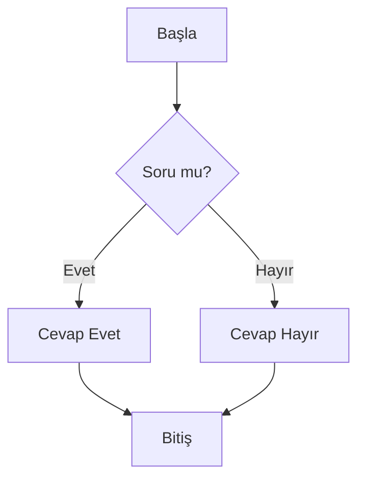

# Gün 1 - Sabah Oturumu: Çalışma Ortamı Hazırlıkları

## 1. Eğitime Giriş

### 1.1 Eğitimin Amacı ve Kapsamı

- PHP, Laravel ve Vue.js kullanarak modern web uygulamaları geliştirme
- Yapay zeka destekli yazılım geliştirme teknikleri
- Ekip çalışması ve versiyon kontrol sistemleri

### 1.2 Ön Gereksinimler

- Temel programlama bilgisi (tercihen PHP veya JavaScript)
- Temel web teknolojileri (HTML, CSS) hakkında bilgi
- Bilgisayar kullanımı konusunda temel beceriler

## 2. Geliştirme Ortamı Kurulumu

### 2.1 Visual Studio Code Kurulumu

1. [VS Code resmi sitesinden](https://code.visualstudio.com/) indirin
2. İşletim sisteminize uygun sürümü seçin
3. Kurulumu tamamlayın

#### Önemli Eklentiler:

- PHP Intelephense
- Laravel Extension Pack
- Volar (Vue 3)
- Prettier - Code formatter
- ESLint
- GitLens
- Live Server
- Markdown All in One

### 2.2 Terminal Kullanımı

#### Windows için:

- PowerShell veya Windows Terminal kullanımı
- Temel komutlar:
  ```bash
  cd          # Dizin değiştirme
  dir         # Dizindeki dosyaları listeleme
  mkdir       # Yeni klasör oluşturma
  del         # Dosya silme
  rmdir       # Klasör silme
  ```

#### macOS/Linux için:

- Terminal veya iTerm2 kullanımı
- Temel komutlar:
  ```bash
  pwd         # Bulunduğun dizini göster
  ls          # Dizindeki dosyaları listele
  cd          # Dizin değiştir
  mkdir       # Yeni klasör oluştur
  rm          # Dosya sil
  rm -r       # Klasör sil
  ```

## 3. Git ve GitHub Kullanımı

### 3.1 Git Kurulumu

1. [Git resmi sitesinden](https://git-scm.com/) indirin
2. Kurulum sırasında varsayılan ayarları kullanın

### 3.2 Temel Git Komutları

```bash
git --version              # Git versiyonunu kontrol et
git config --global user.name "Ad Soyad"
git config --global user.email "email@example.com"
git init                   # Yeni bir depo oluştur
git status                 # Değişiklikleri göster
git add .                  # Tüm değişiklikleri ekle
git commit -m "Mesaj"      # Değişiklikleri kaydet
git log                    # Geçmişi göster
```

### 3.3 GitHub'a Bağlanma

1. [GitHub](https://github.com/)'da hesap oluşturun
2. Yeni bir depo oluşturun
3. Yerel deponuzu uzak depoya bağlayın:
   ```bash
   git remote add origin https://github.com/kullanici-adi/depo-adi.git
   git branch -M main
   git push -u origin main
   ```

## 4. Markdown ile Dokümantasyon

### 4.1 Temel Sözdizimi

````markdown
# Başlık 1

## Başlık 2

### Başlık 3

- Madde işaretli liste
- İkinci madde

1. Sıralı liste
2. İkinci öğe

**Kalın yazı** ve _italik yazı_

[Bağlantı metni](https://ornek.com)


```php
<?php
echo "Kod bloğu örneği";
?>
```
````

### 4.2 Mermaid ile Diyagramlar



## 5. Ödev ve Pratik

1. VS Code'u kurun ve temel kısayolları öğrenin
2. Terminal üzerinden temel komutları deneyin
3. GitHub'da bir hesap oluşturun
4. Yeni bir depo oluşturup ilk commit'inizi yapın
5. README.md dosyası oluşturarak kendinizi tanıtın

## 6. Yararlı Kaynaklar

- [VS Code Kısayolları](https://code.visualstudio.com/shortcuts/keyboard-shortcuts-macos.pdf)
- [Git Resmi Dokümantasyonu](https://git-scm.com/doc)
- [Markdown Kılavuzu](https://www.markdownguide.org/)
- [Mermaid Live Editor](https://mermaid.live/)

---

**Not:** Öğleden sonraki oturumda görüşmek üzere! Lütfen kurulumları tamamlayıp gelin.
