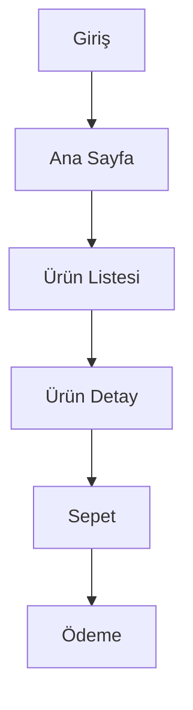

# Gün 8 - Sabah Oturumu: Grup Projesine Başlangıç ve Planlama

## 1. Grup Oluşumu ve Proje Konusu Seçimi

- Katılımcılar ikili gruplara ayrılır.
- Her grup, eğitmenin önerileriyle bir proje konusu belirler (örnek: ürün yönetimi, görev takip, rezervasyon sistemi, blog, küçük e-ticaret, vb).

## 2. Proje Planı Hazırlığı

### 2.1 PRD (Product Requirements Document) Hazırlama

- Projenin amacı ve kapsamı
- Hedef kullanıcılar
- Temel özellikler ve gereksinimler (örn. kullanıcı yönetimi, ürün ekleme, sipariş takibi, vb)
- Kullanıcı rolleri ve yetkiler

### 2.2 Kullanıcı Akışları ve Senaryoları

- Kullanıcıların uygulamada izleyeceği temel yollar
- Örnek kullanıcı hikayeleri (user story):
  - "Bir kullanıcı ürün ekleyebilmeli."
  - "Bir yönetici siparişleri görebilmeli."

### 2.3 UI/UX Planlaması

- Ana sayfa, giriş/kayıt, ürün listesi, detay, ekleme/güncelleme formları gibi temel ekranlar belirlenir
- Her ekran için temel wireframe veya çizim yapılır (kağıt, Figma, Excalidraw, mermaid, vb. araçlar kullanılabilir)

## 3. Akış Diyagramları ve Veri Modeli

### 3.1 Akış Diyagramı

- Kullanıcı yolculuğu ve temel iş akışları için akış şeması hazırlanır
- Örnek: mermaid ile temel akış diyagramı

### 3.2 Veri Tabanı ve API Tasarımı

- Temel tablolar ve ilişkiler belirlenir (örnek: kullanıcılar, ürünler, siparişler)
- API endpointleri ve veri modelleri tasarlanır

## 4. Grup Çalışması ve Paylaşım

- Her grup kendi PRD'sini, akış diyagramını ve temel UI planını hazırlar
- Gruplar, hazırlıklarını kısa sunumlarla paylaşır ve eğitmenden geri bildirim alır

---

Öğleden sonra oturumunda: Proje geliştirmeye başlama, kod tabanı oluşturma ve temel işlevlerin uygulanması.
