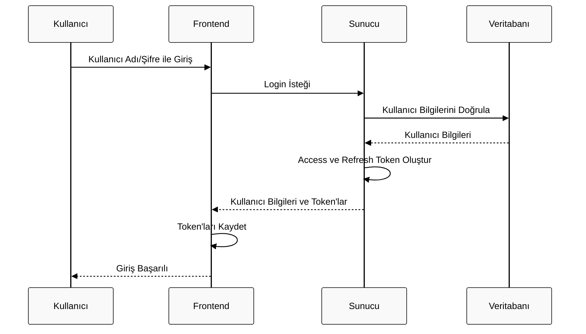
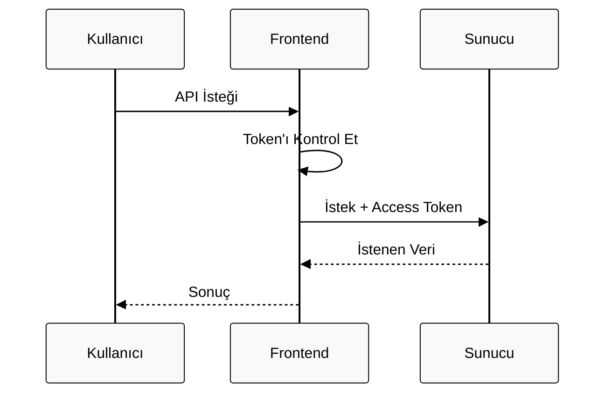
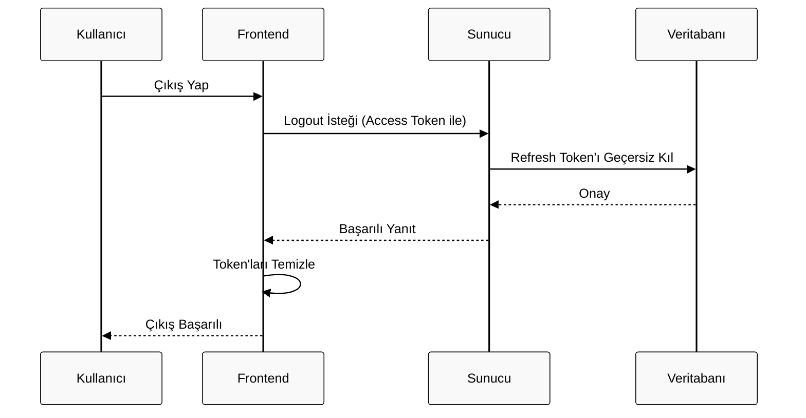
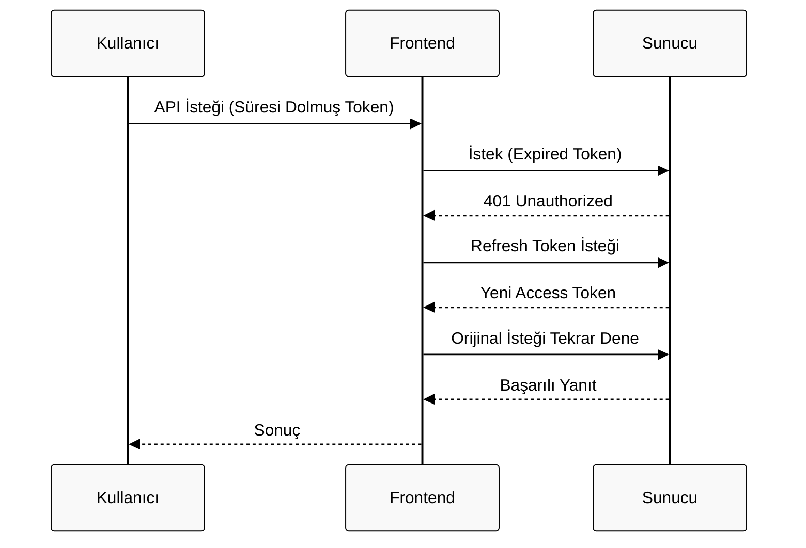
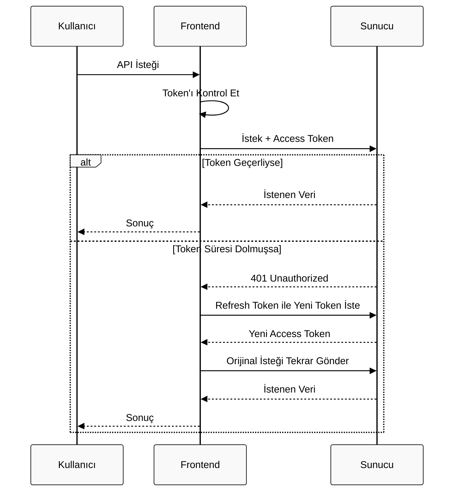

# Token ve Refresh Token

## Login işlemi

Tipit bir login sonucu aşağıdaki JSON yapısını döndürür:

```json
{
  "success": true,
  "data": {
    "user": {
      "id": "123e4567-e89b-12d3-a456-426614174000",
      "email": "kullanici@example.com",
      "firstName": "Ahmet",
      "lastName": "Yılmaz"
    },
    "tokens": {
      "access": {
        "token": "eyJhbGciOiJIUzI1NiIsInR5cCI6IkpXVCJ9...",
        "expires": "2023-12-31T23:59:59.999Z"
      },
      "refresh": {
        "token": "eyJhbGciOiJIUzI1NiIsInR5cCI6IkpXVCJ9...",
        "expires": "2024-01-31T23:59:59.999Z"
      }
    }
  }
}
```

Bu JSON yapısı, tipik bir kullanıcı girişi (login) veya kimlik doğrulama (authentication) işlemi başarılı olduğunda sunucunun döndürdüğü bir yanıtı (response) temsil ediyor. Açıklaması:

### **1. Genel Yapı (`success` ve `data`)**

- `"success": true`: İşlemin başarılı olduğunu belirtir.
- `"data"`: Asıl verinin içinde bulunduğu ana nesne.

### **2. Kullanıcı Bilgileri (`user`)**

- `"user"`: Giriş yapan kullanıcının profil bilgilerini içerir:
  - `"id"`: Kullanıcının benzersiz UUID (Universal Unique Identifier) değeri.  
    _Örnek: `123e4567-e89b-12d3-a456-426614174000`_
  - `"email"`: Kullanıcının kayıtlı e-posta adresi.  
    _Örnek: `kullanici@example.com`_
  - `"firstName"` ve `"lastName"`: Kullanıcının adı ve soyadı.  
    _Örnek: `Ahmet Yılmaz`_

### **3. Token'lar (`tokens`)**

Kullanıcının oturum açıkken yetkilendirme (authorization) yapabilmesi için token'lar döndürülür:

- **Access Token** (`access`):
  - `"token"`: JWT (JSON Web Token) formatında kısa süreli yetki token'ı.  
    _Örnek: `eyJhbGciOiJIUzI1NiIsInR5cCI6IkpXVCJ9...` (şifrelenmiş bir string)_
  - `"expires"`: Token'ın geçerlilik süresinin bittiği tarih.  
    _Örnek: `2023-12-31T23:59:59.999Z` (UTC zaman dilimi)_
- **Refresh Token** (`refresh`):
  - `"token"`: Access Token süresi dolduğunda yeni bir Access Token almak için kullanılan uzun süreli token.
  - `"expires"`: Refresh Token'ın geçerlilik süresi.  
    _Örnek: `2024-01-31T23:59:59.999Z`_

### **Nasıl Çalışır?**

1. Kullanıcı e-posta/şifre ile giriş yapar.
2. Sunucu bilgileri doğrular ve bu JSON yanıtını döndürür.
3. **Access Token**, kullanıcının her isteğinde (`Authorization: Bearer <token>` header'ı ile) sunucuya gönderilir.
4. Access Token süresi dolduğunda, **Refresh Token** kullanılarak yeni bir Access Token alınır.

### **Örnek Kullanım Senaryosu**

- **Frontend** (React, Angular vb.) bu yanıtı alır:
  - Kullanıcı bilgilerini UI'da gösterir.
  - Token'ları `localStorage` veya `cookies`'e kaydeder.
  - Her API isteğinde Access Token'ı header'a ekler.

### **Güvenlik Notları**

- **Access Token** kısa süreli (örnekte 1 ay) olmalıdır.
- **Refresh Token** daha uzun süreli (örnekte 2 ay) olabilir, ancak sıkı güvenlik önlemleri gerektirir.
- Token'lar asla başkasıyla paylaşılmamalıdır.

JSON formatı, modern API'lerde (REST/graphQL) veri alışverişi için yaygın kullanılır. Bu yapı, özellikle JWT tabanlı kimlik doğrulama sistemlerinde standarttır.

## Refresh Token Nedir?

Refresh Token, Access Token'ın süresi dolmadan önce yeni bir Access Token almak için kullanılır. Refresh Token genellikle daha uzun süreli olur ve güvenlik önlemleri daha sıkı uygulanır.

Access Token'ın süresi dolduğunda yeni bir Access Token almak için **Refresh Token'ın kullanımı**, genellikle şu adımlarla tetiklenir:

### **1. Access Token'ın Süresinin Dolması**

- Kullanıcı bir API isteği gönderdiğinde, sunucu Access Token'ı kontrol eder.
- Token'ın süresi dolmuşsa (expire olmuşsa), sunucu **`401 Unauthorized`** hatası döndürür.  
  _(Örnek response: `{"error": "Token expired"}`)_

### **2. Frontend'in Refresh Token Mekanizmasını Tetiklemesi**

Frontend (React, Angular, Vue.js vb.) bu hatayı yakalayıp otomatik olarak yeni bir Access Token talep eder:

```javascript
// Örnek Axios interceptor kullanımı (React/Vue)
axios.interceptors.response.use(
  (response) => response,
  async (error) => {
    const originalRequest = error.config;
    if (error.response.status === 401 && !originalRequest._retry) {
      originalRequest._retry = true;
      // Refresh Token ile yeni Access Token al
      const newToken = await refreshAccessToken();
      axios.defaults.headers.common['Authorization'] = `Bearer ${newToken}`;
      return axios(originalRequest); // Orijinal isteği tekrar gönder
    }
    return Promise.reject(error);
  },
);
```

### **3. Refresh Token ile Yeni Access Token Alma**

Frontend, arkaplanda şu isteği gönderir:

```http
POST /api/auth/refresh-token
Headers: { "Content-Type": "application/json" }
Body: { "refreshToken": "eyJhbGciOiJIUzI1NiIs..." }
```

**Sunucunun Yaptıkları:**

1. Refresh Token'ı veritabanında veya önbellekte kontrol eder.
2. Geçerliyse ve süresi dolmamışsa:
   - **Yeni bir Access Token** oluşturur.
   - **Yanıt olarak döndürür**:
     ```json
     {
       "accessToken": "yeni.jwt.token.xyz",
       "expires": "2023-12-31T23:59:59.999Z"
     }
     ```
3. Geçersizse (örneğin, kullanıcı logout olduysa), **`403 Forbidden`** hatası verir.

### **4. Yeni Token'ın Kullanılması**

- Frontend, gelen yeni Access Token'ı kaydeder (örneğin, `localStorage` veya memory'de).
- Orijinal isteği yeni token ile tekrar gönderir.

### **Önemli Detaylar**

- **Güvenlik**: Refresh Token'lar genellikle **HTTP-only cookie**'de saklanır (XSS saldırılarına karşı koruma için).
- **Tek Kullanımlık**: Bazı sistemlerde Refresh Token yalnızca **bir kez** kullanılabilir (yenisiyle değiştirilir).
- **Logout İşlemi**: Kullanıcı çıkış yaptığında, Refresh Token veritabanından silinir.

## Örnek Akış Diyagramları

### Login



### Token İle Frontend Süreçleri



### Logout



### Refresh Token



Bu mekanizma, kullanıcının sürekli yeniden giriş yapmasını engelleyerek **kullanıcı deneyimini** iyileştirir.

### Frontend Süreçleri (token ve refresh token ile)


